# Gmail Notify

<p align="center">
  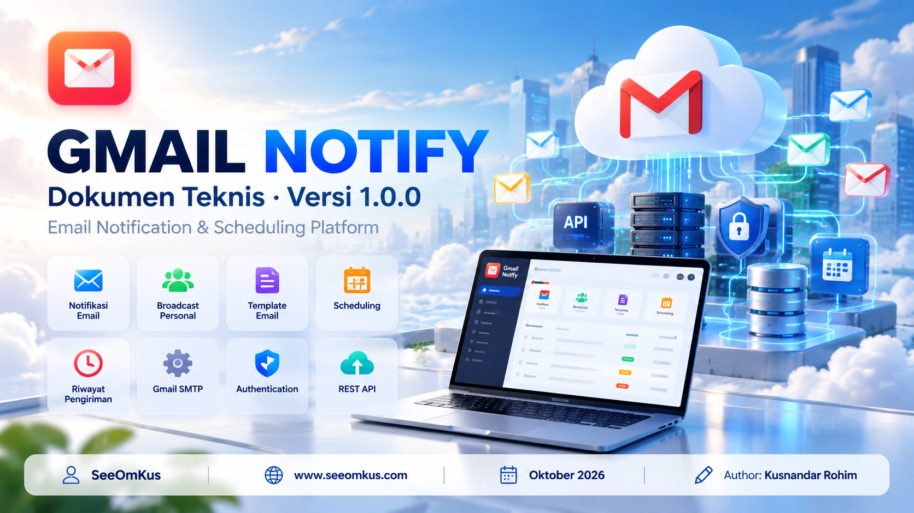
</p>

Aplikasi web untuk mengirim notifikasi email lewat Gmail: template siap pakai, broadcast personal, jadwal otomatis, riwayat pengiriman, serta login manual atau Google.

> **Penulis:** Kusnandar Rohim (**SeeOmKus**) · [www.seeomkus.com](https://www.seeomkus.com) · Oktober 2026

- `backend/` — Express + TypeScript + Nodemailer (SMTP Gmail)
- `frontend/` — Vue 3 + Vite + TypeScript

## Tampilan aplikasi

Mode terang dan gelap, responsif, dengan ikon Material Design berwarna. Tangkapan layar di bawah diambil pada mode demo (alamat email disamarkan).

### Masuk dan daftar

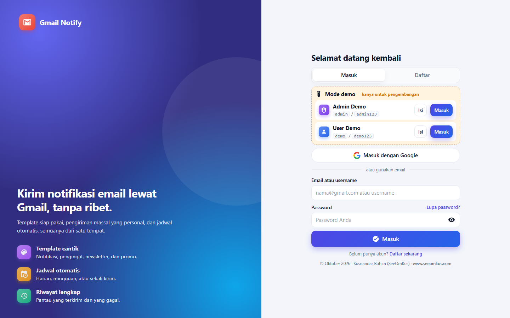

*Login dengan email atau username, atau akun Google. Kartu "Mode demo" hanya tampil saat pengembangan.*

### Kirim email dalam empat langkah

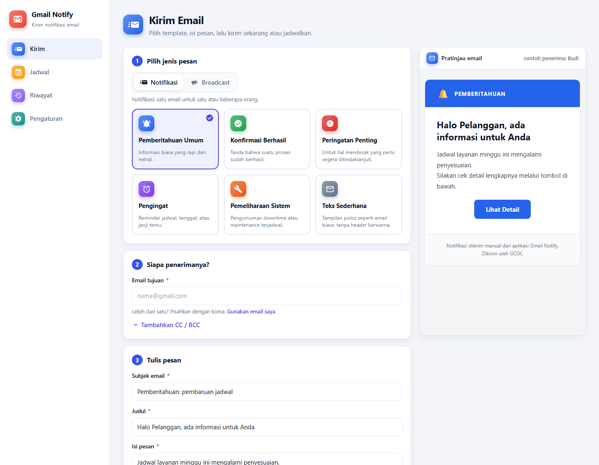

*Pilih template, tentukan penerima, tulis pesan, lalu kirim sekarang atau jadwalkan. Pratinjau email tampil langsung di sisi kanan.*

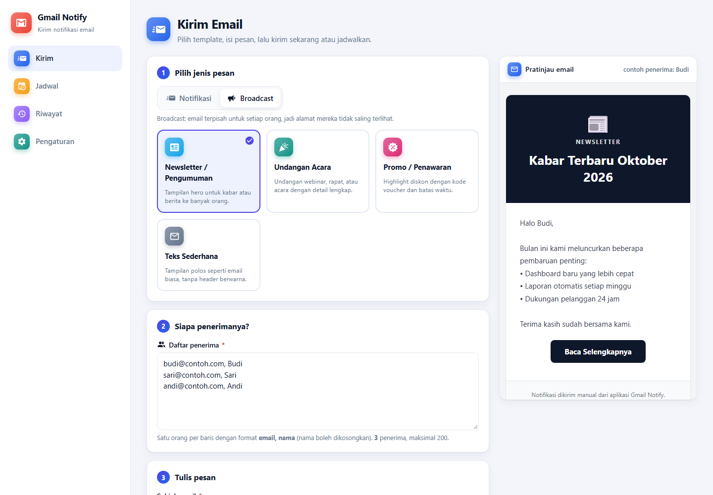

*Broadcast: satu email per penerima dengan personalisasi nama (`{{nama}}`), hingga 200 penerima.*

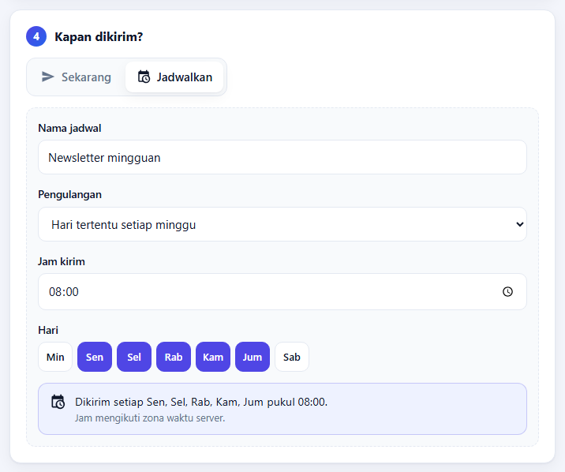

*Jadwal sekali, per interval menit, harian, atau hari tertentu setiap minggu, lengkap dengan ringkasan kalimat.*

### Jadwal otomatis

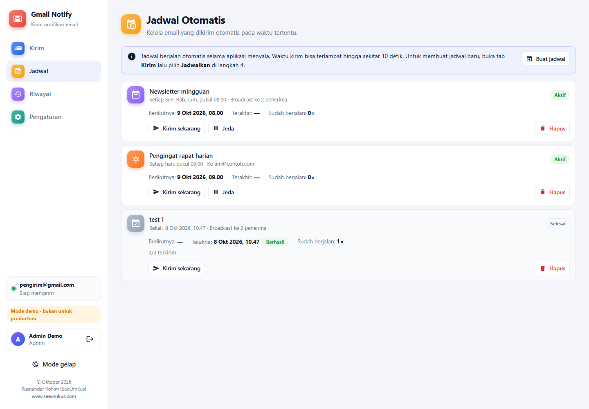

*Pantau waktu berikutnya, hasil terakhir, dan jumlah eksekusi; kirim sekarang, jeda, atau hapus.*

### Riwayat pengiriman

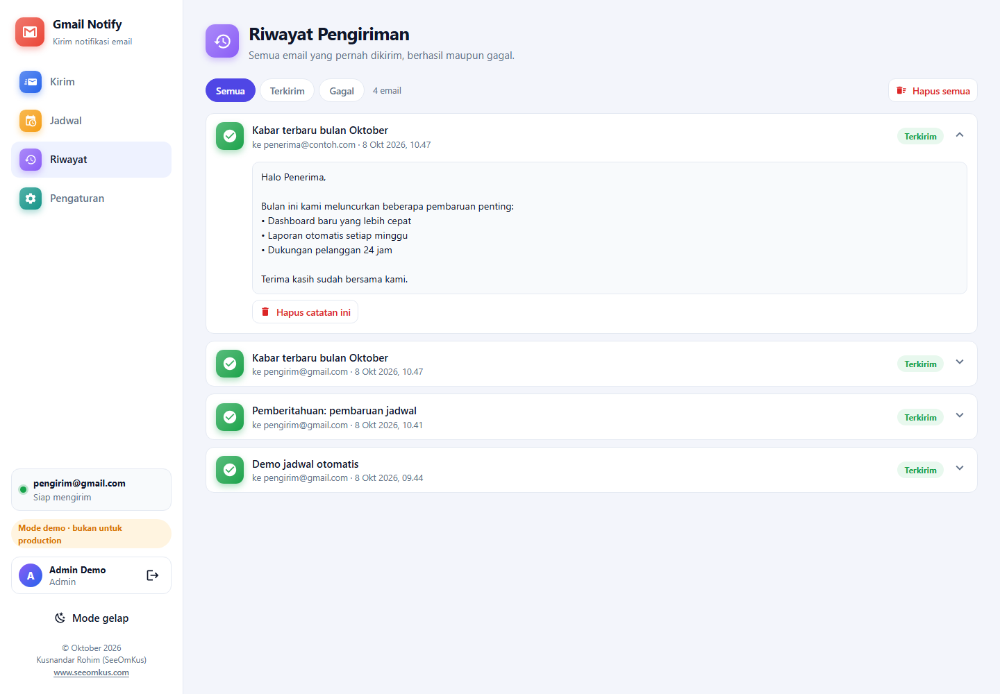

*Setiap email, berhasil maupun gagal, tercatat beserta isi dan pesan error.*

### Pengaturan

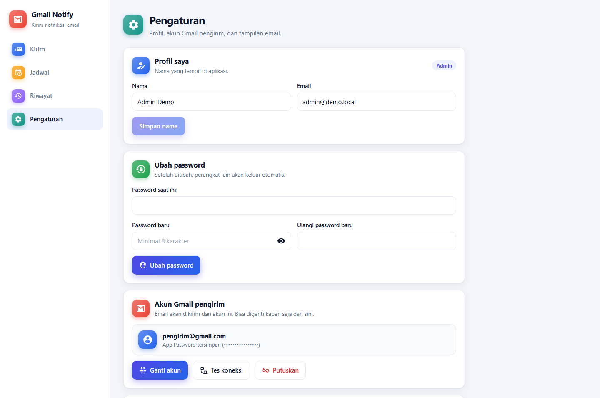

*Akun Gmail pengirim dapat diganti dari antarmuka; akun baru diuji dulu sebelum disimpan.*

### Mode gelap

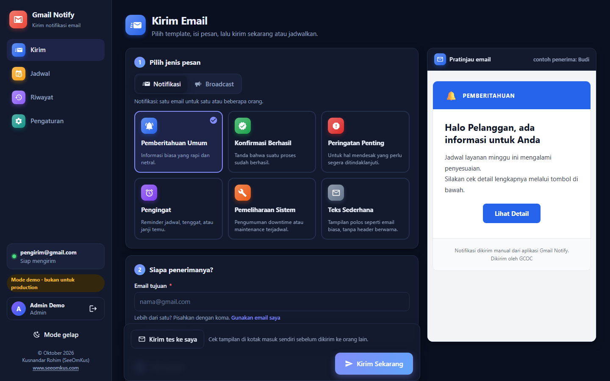

## Instalasi: dari clone sampai berjalan

Ikuti urutan ini sebelum memakai aplikasi. Seluruh langkah berlaku untuk Windows, Linux, dan macOS.

### Prasyarat

| Kebutuhan | Keterangan |
|---|---|
| **Git** | Untuk mengunduh (clone) repositori |
| **Node.js 18+** (disarankan 22 LTS) dan **npm** | Cek dengan `node -v` dan `npm -v` |
| **Akun Gmail** dengan Verifikasi 2 Langkah | Hanya diperlukan untuk mengirim email (dijelaskan di Langkah 5) |
| Koneksi internet | Untuk `npm install` dan untuk terhubung ke `smtp.gmail.com:465` |

> Jika `npm install` gagal membangun `better-sqlite3` di Linux, pasang alat build terlebih dahulu: `sudo apt install -y build-essential python3` (Debian/Ubuntu). Di Windows biasanya berkas siap pakai diunduh otomatis.

### Langkah 1: Clone repositori

```bash
git clone https://github.com/seeomkus/gmail-notify.git
cd gmail-notify
```

### Langkah 2: Pasang dependensi

Cara paling mudah, satu perintah untuk memasang dependensi **dan** membangun backend serta frontend:

```bash
# Linux / macOS
./app.sh build --install

# Windows (Command Prompt atau PowerShell)
app.cmd build --install
```

Atau pasang manual (cukup untuk mode pengembangan):

```bash
cd backend && npm install && cd ..
cd frontend && npm install && cd ..
```

### Langkah 3: Konfigurasi (opsional)

Aplikasi dapat langsung berjalan tanpa berkas konfigurasi. Akun Gmail diatur nanti lewat halaman **Pengaturan**. Jika ingin mengubah port atau nilai awal lainnya, salin berkas contoh:

```bash
# Linux / macOS
cp backend/.env.example backend/.env

# Windows
copy backend\.env.example backend\.env
```

Port bawaan adalah **3100**. Berkas `backend/.env` berisi data rahasia dan sudah diabaikan git, jangan pernah di-commit.

### Langkah 4: Jalankan aplikasi

Pilih salah satu.

**A. Mode produksi (satu proses, paling sederhana)**

```bash
./app.sh start      # Linux / macOS
app.cmd start       # Windows
```

Pada pemakaian pertama, perintah ini otomatis memasang dependensi dan membangun aplikasi bila belum ada. Buka **http://localhost:3100**, lalu daftarkan akun. **Akun yang pertama mendaftar otomatis menjadi admin.** Perintah lain: `status`, `logs`, `restart`, `stop` (lihat bagian *Menjalankan di server* di bawah).

**B. Mode pengembangan (dua terminal, ada akun demo)**

```bash
# terminal 1: backend (port 3100)
cd backend
npm run dev

# terminal 2: frontend (port 5180)
cd frontend
npm run dev
```

Buka **http://localhost:5180**. Pada mode ini kartu **Mode demo** tampil di halaman masuk. Klik **Masuk** pada *Admin Demo* (`admin` / `admin123`).

### Langkah 5: Hubungkan akun Gmail pengirim

1. Aktifkan **Verifikasi 2 Langkah** di akun Google yang akan dipakai mengirim.
2. Buka https://myaccount.google.com/apppasswords lalu buat **App Password** (16 karakter). Ini bukan password login Gmail Anda.
3. Masuk ke aplikasi sebagai **admin**, buka **Pengaturan > Akun Gmail pengirim**, klik **Ganti akun**, isi alamat Gmail dan App Password, lalu **Tes & simpan akun**.
4. Kembali ke halaman **Kirim**, pilih template, lalu klik **Kirim tes ke saya** untuk mencoba.

Login dengan Google bersifat opsional dan perlu OAuth Client ID, lihat bagian *Mengaktifkan "Masuk dengan Google"* di bawah.

### Memperbarui ke versi terbaru

```bash
git pull origin main
./app.sh restart --build     # Windows: app.cmd restart --build
```

Pada mode pengembangan, cukup `git pull`. Jika `package.json` berubah, jalankan `npm install` lagi di folder `backend` dan `frontend`.

### Masalah umum saat instalasi

| Gejala | Solusi |
|---|---|
| `./app.sh: Permission denied` | `chmod +x app.sh scripts/app.mjs`, lalu ulangi |
| `Node.js 18+ diperlukan` | Perbarui Node.js ke versi 18 atau lebih baru (disarankan 22 LTS) |
| `Port 3100 sudah dipakai proses lain` | Ubah `PORT` di `backend/.env`, atau hentikan proses yang memakai port itu |
| Error saat memasang `better-sqlite3` | Pasang alat build (lihat catatan Prasyarat), lalu jalankan `./app.sh build --install` |
| Kartu demo tidak tampil | Normal pada mode produksi (`app.sh start`). Pakai mode pengembangan atau daftar akun sendiri |
| Email gagal terkirim | Pastikan memakai **App Password**, bukan password login; tes lewat Pengaturan > Tes koneksi |

## API

`POST /api/notify` — body JSON: `{ "to": "...", "subject": "...", "message": "..." }`

## Menjalankan di server (build / start / stop / restart / status)

Mode produksi memakai satu proses: backend hasil build juga menyajikan frontend, jadi cukup satu port
(`PORT` di `backend/.env`, default **3100**). Butuh Node.js 18+.

| Perintah | Linux / macOS | Windows | Keterangan |
|---|---|---|---|
| Build | `./app.sh build` | `app.cmd build` | `--install` untuk `npm install` ulang |
| Start | `./app.sh start` | `app.cmd start` | Jalan di background, build otomatis jika belum ada |
| Stop | `./app.sh stop` | `app.cmd stop` | |
| Restart | `./app.sh restart` | `app.cmd restart` | `--build` untuk build ulang dulu |
| Status | `./app.sh status` | `app.cmd status` | Exit code 3 jika berhenti |
| Log | `./app.sh logs 100` | `app.cmd logs 100` | Default 50 baris terakhir |

Semuanya juga tersedia lewat `npm run build|start|stop|restart|status|logs` di folder utama.

Catatan:
- PID dan log disimpan di folder `.run/` (`.run/app.log`).
- Setelah memindahkan proyek antar OS, jalankan `./app.sh build --install` karena modul native SQLite berbeda per platform.
- Setelah mengubah kode, jalankan `restart --build`.
- Agar otomatis hidup saat server reboot di Linux, jalankan `./app.sh start` dari systemd, atau gunakan unit berikut:

```ini
[Unit]
Description=Gmail Notify
After=network.target

[Service]
WorkingDirectory=/opt/gmail-notify/backend
ExecStart=/usr/bin/node dist/server.js
Environment=NODE_ENV=production
Restart=on-failure

[Install]
WantedBy=multi-user.target
```

## Login, pendaftaran, dan lupa password

Semua halaman dan API (kecuali `/api/health` dan `/api/auth/*`) wajib login.

- **Pendaftar pertama otomatis menjadi admin** (atau akun dengan email `ADMIN_EMAIL` jika diisi). Admin mengatur akun Gmail
  pengirim, tampilan email, dan akses. Pengguna biasa dapat mengirim email, mengelola jadwal, dan mengubah profil/password.
- **Daftar & masuk manual**: nama, email, password (min. 8 karakter). Password disimpan sebagai hash scrypt, sesi memakai
  cookie `HttpOnly` selama 7 hari, dan login dibatasi 5 kali gagal per 15 menit.
- **Masuk dengan Google**: buat OAuth Client ID (Web application) di Google Cloud Console, tambahkan alamat aplikasi di
  *Authorized JavaScript origins*, lalu isi Client ID di **Pengaturan > Akses & masuk dengan Google**. Akun Google yang emailnya
  sudah terdaftar otomatis ditautkan; yang belum terdaftar dibuatkan akun baru (jika pendaftaran diizinkan).
- **Lupa password**: tautan reset (berlaku 30 menit, sekali pakai) dikirim lewat akun Gmail pengirim yang sudah dihubungkan.
  Jika pengiriman gagal, tautan dicatat di log server (`./app.sh logs`) agar admin tetap bisa memulihkan akses.
- Produksi: gunakan HTTPS dan isi `APP_URL` serta `TRUST_PROXY=1` jika di belakang Nginx.

## Mode demo (akun contoh)

Saat pengembangan (`npm run dev`), halaman login menampilkan kartu **Mode demo** berisi akun contoh:

| Username | Password | Peran |
|---|---|---|
| `admin` | `admin123` | Admin (bisa mengatur akun Gmail, Client ID Google, dan akses) |
| `demo` | `demo123` | Pengguna biasa |

- Login boleh memakai **email atau username**. Akun demo tidak dihitung sebagai pengguna sungguhan, jadi pendaftar pertama
  (non-demo) tetap otomatis menjadi admin.
- **Production**: dengan `./app.sh start` (NODE_ENV=production) kartu demo tidak tampil, API tidak pernah mengirim kredensial
  demo, dan akun demo **dihapus dari database** saat server start. Anda juga bisa memaksanya lewat `DEMO_MODE=1` / `DEMO_MODE=0`
  di `backend/.env`.

## Mengaktifkan "Masuk dengan Google"

Client ID hanya diisi admin setelah login: **Pengaturan > Akses & masuk dengan Google**. Di sana ada panduan 7 langkah
(buat project, layar persetujuan, test users, OAuth client ID, Authorized JavaScript origins, salin Client ID). Sebelum diisi,
tombol Google di halaman login tampil nonaktif dengan keterangan "Belum diaktifkan".

## Gambaran arsitektur dan alur

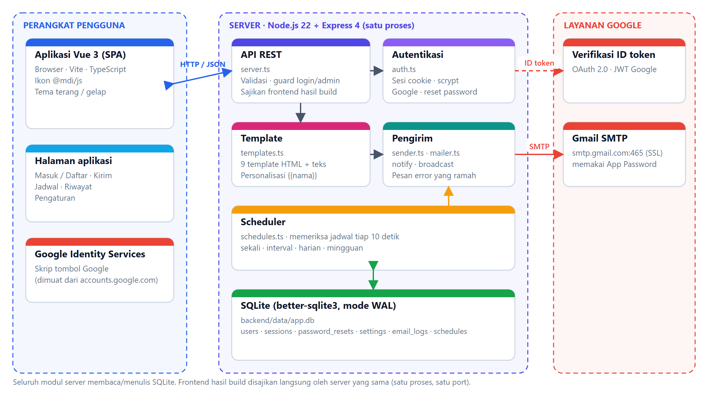

*Arsitektur: browser (Vue 3 SPA), server Node.js + Express dalam satu proses, SQLite, serta layanan Google (SMTP dan verifikasi ID token).*

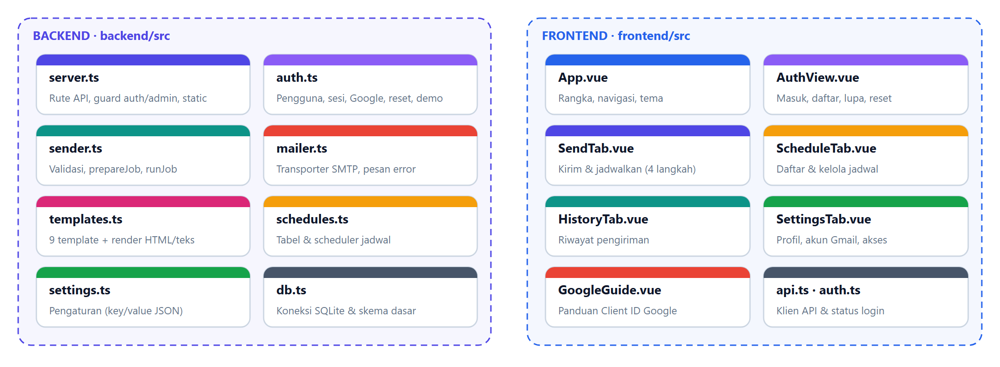

*Peta modul backend dan frontend beserta tanggung jawabnya.*

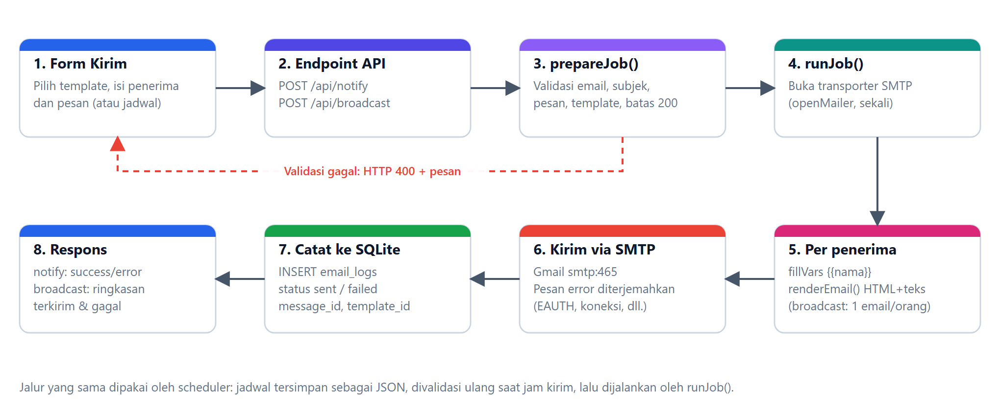

*Alur pengiriman: form, validasi, penyusunan template, SMTP, lalu pencatatan riwayat. Jalur yang sama dipakai scheduler.*

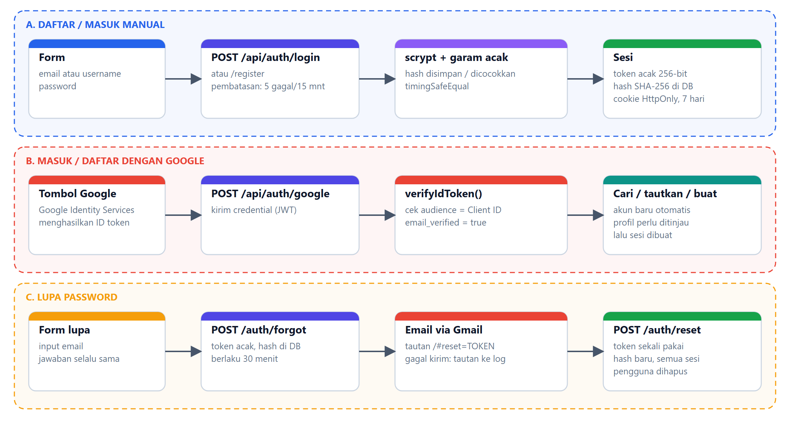

*Tiga alur autentikasi: daftar/masuk manual, Google, dan lupa password.*

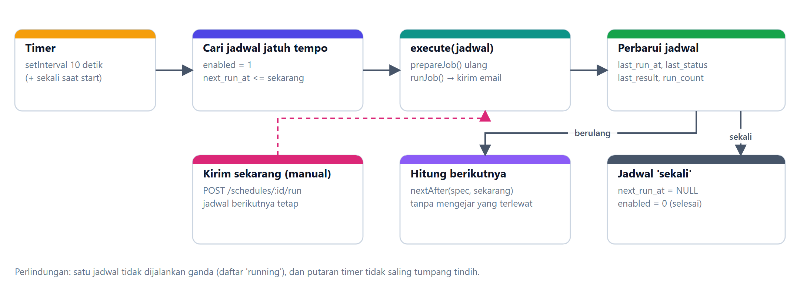

*Scheduler memeriksa jadwal jatuh tempo setiap 10 detik.*

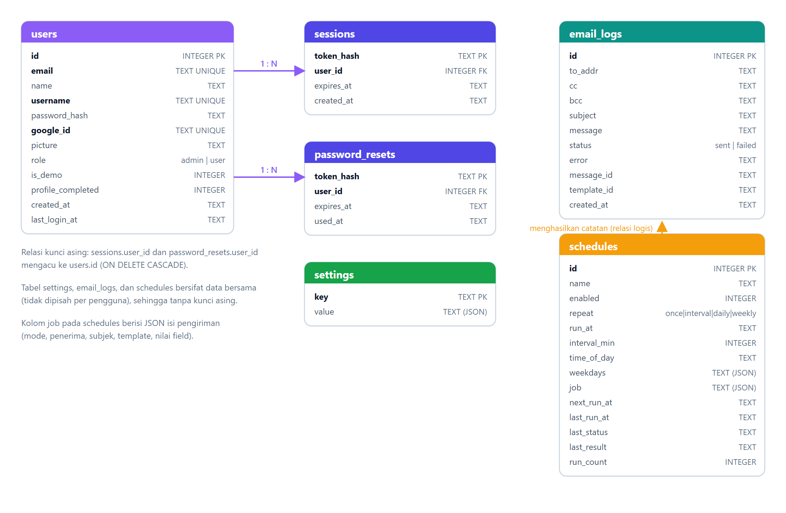

*Skema SQLite: users, sessions, password_resets, settings, email_logs, schedules.*

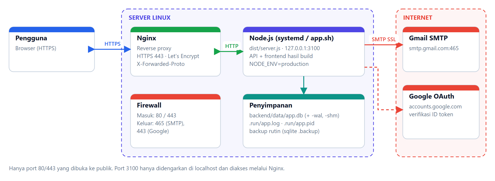

*Deployment di Linux: Nginx sebagai reverse proxy HTTPS di depan satu proses Node.js.*

## Dokumentasi teknis

Dokumen teknis lengkap (arsitektur, basis data, antarmuka, API, keamanan, deployment, pengujian, operasional) tersedia dalam dua format:

| Format | Berkas |
|---|---|
| PDF (sampul, daftar isi, riwayat revisi, daftar pustaka) | [`docs/Dokumen-Teknis-Gmail-Notify-v1.0.0.pdf`](docs/Dokumen-Teknis-Gmail-Notify-v1.0.0.pdf) |
| Markdown | [`docs/DOKUMEN-TEKNIS.md`](docs/DOKUMEN-TEKNIS.md) |

Keduanya dibuat dari satu sumber isi di `docs/build/` (`content-1.mjs`, `content-2.mjs`) sehingga selalu konsisten.
Untuk memperbarui setelah mengubah isi:

```bash
cd docs/build
npm install
npm run images   # (opsional) ambil ulang diagram dan screenshot; butuh Chrome dan aplikasi mode demo berjalan
npm run docs     # bangun Markdown dan PDF (Microsoft Word memperbarui daftar isi lalu mengekspor PDF)
```

Catatan: langkah PDF memakai otomasi Microsoft Word (Windows). Berkas Word perantara hanya disimpan lokal di `docs/build/out/` (diabaikan git), sehingga yang dipublikasikan hanya PDF yang tidak mudah diubah. Saat menaikkan versi, ubah `meta` dan `revisions` di `docs/build/build.mjs`.

## Penulis

| | |
|---|---|
| **Nama** | Kusnandar Rohim |
| **Nama lain** | SeeOmKus |
| **Situs web** | [www.seeomkus.com](https://www.seeomkus.com) |
| **Dibuat** | Oktober 2026 |

© 2026 Kusnandar Rohim (SeeOmKus). Seluruh hak cipta dilindungi.
