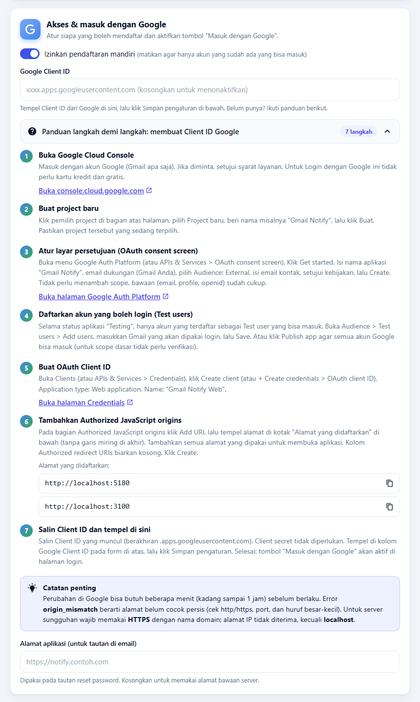
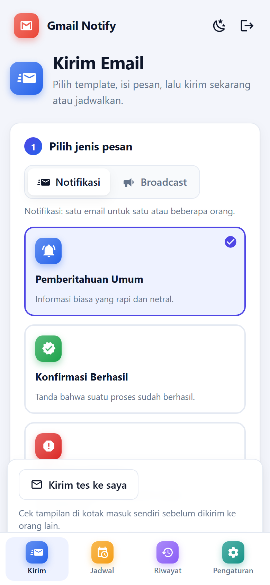

# Gmail Notify: Dokumen Teknis Aplikasi Notifikasi Email

> Arsitektur, basis data, antarmuka, spesifikasi API, keamanan, deployment, pengujian, dan operasional.

| Atribut | Keterangan |
|---|---|
| Kode dokumen | GN-TD-001 |
| Versi | 1.0.0 |
| Tanggal | 8 Oktober 2026 |
| Status | Rilis |
| Klasifikasi | Internal |
| Penyusun | Kusnandar Rohim (SeeOmKus) |
| Situs web | www.seeomkus.com |
| Periode | Oktober 2026 |

## Riwayat Revisi

| Versi | Tanggal | Penyusun | Perubahan | Status |
|---|---|---|---|---|
| 1.0.0 | 8 Oktober 2026 | Kusnandar Rohim (SeeOmKus) | Rilis awal dokumen teknis: arsitektur, desain basis data, antarmuka, spesifikasi fungsional dan API, keamanan, konfigurasi dan deployment, pengujian, operasional, serta rencana pengembangan. | Rilis |

> Dokumen ini dibuat otomatis dari sumber yang sama dengan PDF (`docs/build`). Versi PDF: [`Dokumen-Teknis-Gmail-Notify-v1.0.0.pdf`](Dokumen-Teknis-Gmail-Notify-v1.0.0.pdf).

## Daftar Isi

- [1. Pendahuluan](#1-pendahuluan)
  - [1.1 Latar Belakang](#11-latar-belakang)
  - [1.2 Tujuan Dokumen](#12-tujuan-dokumen)
  - [1.3 Ruang Lingkup](#13-ruang-lingkup)
  - [1.4 Target Pembaca](#14-target-pembaca)
  - [1.5 Istilah dan Singkatan](#15-istilah-dan-singkatan)
  - [1.6 Penulis dan Hak Cipta](#16-penulis-dan-hak-cipta)
- [2. Gambaran Umum Sistem](#2-gambaran-umum-sistem)
  - [2.1 Deskripsi Aplikasi](#21-deskripsi-aplikasi)
  - [2.2 Fitur Utama](#22-fitur-utama)
  - [2.3 Peran Pengguna dan Hak Akses](#23-peran-pengguna-dan-hak-akses)
  - [2.4 Batasan dan Asumsi](#24-batasan-dan-asumsi)
- [3. Arsitektur Sistem](#3-arsitektur-sistem)
  - [3.1 Arsitektur Tingkat Tinggi](#31-arsitektur-tingkat-tinggi)
  - [3.2 Teknologi yang Digunakan](#32-teknologi-yang-digunakan)
  - [3.3 Struktur Direktori Proyek](#33-struktur-direktori-proyek)
  - [3.4 Komponen Backend](#34-komponen-backend)
  - [3.5 Komponen Frontend](#35-komponen-frontend)
  - [3.6 Alur Data Utama](#36-alur-data-utama)
- [4. Desain Basis Data](#4-desain-basis-data)
  - [4.1 Gambaran Umum](#41-gambaran-umum)
  - [4.2 Diagram Relasi Entitas](#42-diagram-relasi-entitas)
  - [4.3 Kamus Data](#43-kamus-data)
  - [4.4 Migrasi](#44-migrasi)
- [5. Desain Antarmuka Pengguna](#5-desain-antarmuka-pengguna)
  - [5.1 Prinsip Desain](#51-prinsip-desain)
  - [5.2 Struktur Navigasi](#52-struktur-navigasi)
  - [5.3 Halaman Masuk dan Daftar](#53-halaman-masuk-dan-daftar)
  - [5.4 Halaman Kirim](#54-halaman-kirim)
  - [5.5 Halaman Jadwal](#55-halaman-jadwal)
  - [5.6 Halaman Riwayat](#56-halaman-riwayat)
  - [5.7 Halaman Pengaturan](#57-halaman-pengaturan)
  - [5.8 Responsif dan Aksesibilitas](#58-responsif-dan-aksesibilitas)
- [6. Spesifikasi Fungsional](#6-spesifikasi-fungsional)
  - [6.1 Pengiriman Notifikasi](#61-pengiriman-notifikasi)
  - [6.2 Template Email](#62-template-email)
  - [6.3 Broadcast](#63-broadcast)
  - [6.4 Penjadwalan](#64-penjadwalan)
  - [6.5 Riwayat Pengiriman](#65-riwayat-pengiriman)
  - [6.6 Manajemen Akun Gmail Pengirim](#66-manajemen-akun-gmail-pengirim)
  - [6.7 Autentikasi dan Otorisasi](#67-autentikasi-dan-otorisasi)
  - [6.8 Mode Demo](#68-mode-demo)
- [7. Spesifikasi API](#7-spesifikasi-api)
  - [7.1 Konvensi](#71-konvensi)
  - [7.2 Endpoint Autentikasi](#72-endpoint-autentikasi)
  - [7.3 Endpoint Pengaturan](#73-endpoint-pengaturan)
  - [7.4 Endpoint Template](#74-endpoint-template)
  - [7.5 Endpoint Pengiriman](#75-endpoint-pengiriman)
  - [7.6 Endpoint Jadwal](#76-endpoint-jadwal)
  - [7.7 Endpoint Riwayat dan Kesehatan](#77-endpoint-riwayat-dan-kesehatan)
- [8. Keamanan](#8-keamanan)
  - [8.1 Autentikasi dan Manajemen Sesi](#81-autentikasi-dan-manajemen-sesi)
  - [8.2 Penyimpanan Kredensial](#82-penyimpanan-kredensial)
  - [8.3 Validasi Input dan Sanitasi](#83-validasi-input-dan-sanitasi)
  - [8.4 Pembatasan Percobaan](#84-pembatasan-percobaan)
  - [8.5 Perlindungan Pemulihan Akun](#85-perlindungan-pemulihan-akun)
  - [8.6 Risiko yang Diketahui dan Mitigasi](#86-risiko-yang-diketahui-dan-mitigasi)
- [9. Konfigurasi dan Deployment](#9-konfigurasi-dan-deployment)
  - [9.1 Prasyarat](#91-prasyarat)
  - [9.2 Variabel Lingkungan](#92-variabel-lingkungan)
  - [9.3 Instalasi dan Build](#93-instalasi-dan-build)
  - [9.4 Menjalankan Aplikasi](#94-menjalankan-aplikasi)
  - [9.5 Deployment di Linux](#95-deployment-di-linux)
  - [9.6 Backup dan Pemulihan](#96-backup-dan-pemulihan)
  - [9.7 Menyiapkan App Password Gmail](#97-menyiapkan-app-password-gmail)
  - [9.8 Mengaktifkan Masuk dengan Google](#98-mengaktifkan-masuk-dengan-google)
- [10. Pengujian](#10-pengujian)
  - [10.1 Strategi Pengujian](#101-strategi-pengujian)
  - [10.2 Skenario Uji dan Hasil](#102-skenario-uji-dan-hasil)
  - [10.3 Cakupan yang Belum Diuji](#103-cakupan-yang-belum-diuji)
  - [10.4 Rekomendasi Pengujian Otomatis](#104-rekomendasi-pengujian-otomatis)
- [11. Operasional dan Pemeliharaan](#11-operasional-dan-pemeliharaan)
  - [11.1 Pemantauan dan Log](#111-pemantauan-dan-log)
  - [11.2 Pemecahan Masalah](#112-pemecahan-masalah)
  - [11.3 Batas dan Kuota Gmail](#113-batas-dan-kuota-gmail)
  - [11.4 Pemeliharaan Rutin](#114-pemeliharaan-rutin)
- [12. Keterbatasan dan Rencana Pengembangan](#12-keterbatasan-dan-rencana-pengembangan)
  - [12.1 Keterbatasan Saat Ini](#121-keterbatasan-saat-ini)
  - [12.2 Rencana Pengembangan](#122-rencana-pengembangan)
- [Daftar Pustaka](#daftar-pustaka)

## 1. Pendahuluan


### 1.1 Latar Belakang

Pengiriman notifikasi email sering dilakukan secara manual dan tidak terdokumentasi: pesan ditulis ulang setiap kali, tampilan email tidak seragam, tidak ada catatan siapa yang sudah menerima, dan pengiriman berulang harus diingat sendiri oleh operator. Banyak tim kecil dan penggiat komunitas sudah memakai Gmail sebagai kanal pengiriman, tetapi belum memiliki aplikasi sederhana yang membungkus Gmail menjadi alat notifikasi yang rapi.

**Gmail Notify** adalah aplikasi web yang menjawab kebutuhan tersebut. Aplikasi ini mengirim email melalui akun Gmail milik organisasi (memakai App Password lewat protokol SMTP), menyediakan template email siap pakai, pengiriman massal (broadcast) yang personal, penjadwalan otomatis, riwayat pengiriman, serta manajemen pengguna dengan login manual maupun akun Google.


### 1.2 Tujuan Dokumen

Dokumen ini adalah acuan teknis tunggal untuk Gmail Notify versi 1.0.0. Dokumen ini dimaksudkan untuk:

- menjelaskan arsitektur, komponen, dan keputusan desain agar mudah dipahami pengembang baru;
- mendokumentasikan skema basis data, spesifikasi API, dan perilaku fungsional secara rinci;
- memberi panduan instalasi, konfigurasi, deployment, dan operasional di Windows maupun Linux;
- mencatat pertimbangan keamanan, hasil pengujian, keterbatasan, dan rencana pengembangan.


### 1.3 Ruang Lingkup

Cakupan dokumen meliputi seluruh kode pada repositori `gmail-notify`: backend (`backend/`), frontend (`frontend/`), skrip pengelola aplikasi (`scripts/app.mjs`, `app.sh`, `app.cmd`), serta pembuat dokumen (`docs/build/`). Di luar cakupan: konfigurasi infrastruktur milik pihak ketiga (akun Google Cloud, server Nginx milik organisasi) selain contoh yang disertakan sebagai panduan.


### 1.4 Target Pembaca

**Tabel 1.** Target pembaca dan bagian yang paling relevan

| Pembaca | Kebutuhan | Bab terkait |
|---|---|---|
| Pengembang backend | Memahami modul, API, basis data, dan keamanan | 3, 4, 6, 7, 8 |
| Pengembang frontend | Memahami komponen, alur UI, dan kontrak API | 3, 5, 7 |
| Administrator / DevOps | Instalasi, konfigurasi, deployment, backup | 9, 11 |
| Penguji (QA) | Skenario fungsional dan hasil pengujian | 6, 10 |
| Pemangku kepentingan | Gambaran fitur, batasan, dan rencana | 1, 2, 12 |


### 1.5 Istilah dan Singkatan

**Tabel 2.** Daftar istilah dan singkatan

| Istilah | Penjelasan |
|---|---|
| SMTP | *Simple Mail Transfer Protocol*, protokol pengiriman email. Aplikasi memakai `smtp.gmail.com` port 465 (SSL). |
| App Password | Sandi aplikasi 16 karakter yang dibuat di akun Google (butuh Verifikasi 2 Langkah) sebagai pengganti password login untuk aplikasi pihak ketiga. |
| Notifikasi | Pengiriman satu email ke satu atau beberapa penerima dalam satu pesan (semua tampak di kolom To). |
| Broadcast | Pengiriman email terpisah ke tiap penerima sehingga alamat tidak saling terlihat dan isi dapat dipersonalisasi. |
| Template | Kerangka tampilan email (HTML dan teks) dengan field yang dapat diisi, misalnya judul, pesan, dan tombol. |
| Scheduler | Pemeriksa jadwal di server yang menjalankan pengiriman otomatis pada waktu yang ditentukan. |
| SPA | *Single Page Application*: aplikasi web yang dimuat sekali dan berpindah halaman tanpa memuat ulang. |
| REST API | Antarmuka server berbasis HTTP dan JSON yang dipakai frontend. |
| WAL | *Write-Ahead Logging*, mode jurnal SQLite yang memungkinkan baca dan tulis berjalan bersamaan. |
| GIS | *Google Identity Services*, pustaka tombol "Masuk dengan Google" yang menghasilkan ID token. |
| ID token | Token JWT bertanda tangan Google yang berisi identitas pengguna; diverifikasi server sebelum membuat sesi. |
| scrypt | Fungsi turunan kunci berbiaya memori tinggi untuk menyimpan hash password. |
| Sesi | Status login pengguna di server, diwakili cookie `sid` yang `HttpOnly`. |


### 1.6 Penulis dan Hak Cipta

**Tabel 3.** Informasi penulis

| Atribut | Keterangan |
|---|---|
| Nama | Kusnandar Rohim |
| Nama lain | SeeOmKus |
| Situs web | www.seeomkus.com |
| Periode pembuatan | Oktober 2026 |

Gmail Notify dan dokumen ini disusun oleh **Kusnandar Rohim** (nama lain **SeeOmKus**) pada bulan Oktober 2026. Informasi lebih lanjut tersedia di www.seeomkus.com. Hak cipta © 2026 Kusnandar Rohim (SeeOmKus).


## 2. Gambaran Umum Sistem


### 2.1 Deskripsi Aplikasi

Gmail Notify terdiri atas aplikasi web (frontend) dan layanan server (backend) yang berjalan dalam satu proses Node.js. Pengguna masuk, memilih template, menentukan penerima, menulis pesan, lalu mengirim sekarang atau menjadwalkannya. Server menyusun email HTML dan teks, mengirimnya lewat SMTP Gmail, dan mencatat setiap hasil ke basis data SQLite.

Konfigurasi akun Gmail pengirim, tampilan email, dan pengaturan akses dapat diubah langsung dari antarmuka web oleh admin; tidak diperlukan penyuntingan berkas konfigurasi di server setelah instalasi awal.


### 2.2 Fitur Utama

**Tabel 4.** Ringkasan fitur Gmail Notify 1.0.0

| Fitur | Deskripsi |
|---|---|
| Pengiriman notifikasi | Kirim ke satu atau banyak penerima dengan CC/BCC, memakai template atau pesan polos, dengan pratinjau langsung. |
| Template email | Sembilan template (lima notifikasi, tiga broadcast, satu netral) dengan ikon, warna, dan field khusus. |
| Broadcast personal | Satu email per penerima, personalisasi `{{nama}}` dan `{{email}}`, hingga 200 penerima per pengiriman. |
| Penjadwalan otomatis | Sekali, interval menit, harian, atau hari tertentu setiap minggu; kelola, jeda, kirim sekarang, hapus. |
| Riwayat pengiriman | Catatan sukses/gagal beserta isi, penerima, template, dan pesan error; filter dan paginasi. |
| Manajemen akun Gmail | Ganti akun pengirim dengan uji koneksi sebelum disimpan, putuskan akun, dan tes koneksi. |
| Login dan daftar | Manual (email/username dan password) atau Google; lupa dan reset password lewat email. |
| Peran pengguna | Admin (mengelola pengaturan) dan pengguna biasa (mengirim dan menjadwalkan). |
| Mode demo | Akun contoh `admin` dan `demo` untuk pengembangan; otomatis hilang di production. |
| Pengelola aplikasi | Skrip build, start, stop, restart, status, dan logs untuk Windows dan Linux. |
| Antarmuka modern | Responsif, tema terang/gelap, ikon Material Design berwarna, notifikasi toast, dan dialog konfirmasi. |


### 2.3 Peran Pengguna dan Hak Akses

Sistem mengenal dua peran. Pendaftar sungguhan pertama otomatis menjadi **admin** (atau akun yang emailnya ditentukan lewat `ADMIN_EMAIL`). Akun demo tidak dihitung sebagai pengguna sungguhan.

**Tabel 5.** Matriks hak akses berdasarkan peran

| Kemampuan | Admin | Pengguna | Tanpa login |
|---|---|---|---|
| Melihat halaman masuk, daftar, lupa dan reset password | Ya | Ya | Ya |
| Mengirim notifikasi dan broadcast | Ya | Ya | Tidak |
| Membuat, menjeda, menjalankan, menghapus jadwal | Ya | Ya | Tidak |
| Melihat dan menghapus riwayat | Ya | Ya | Tidak |
| Membaca pengaturan (tanpa password) | Ya | Ya | Tidak |
| Mengubah profil dan password sendiri | Ya | Ya | Tidak |
| Mengubah akun Gmail pengirim dan tampilan email | Ya | Tidak | Tidak |
| Mengatur Client ID Google, izin pendaftaran, URL aplikasi | Ya | Tidak | Tidak |


### 2.4 Batasan dan Asumsi

- Satu akun Gmail pengirim aktif pada satu waktu; seluruh pengguna berbagi akun tersebut.
- Data (jadwal, riwayat, pengaturan) bersifat bersama, belum dipisah per pengguna.
- Pengiriman tunduk pada kuota Google (kira-kira 500 penerima per hari untuk akun Gmail biasa; nilai dapat berubah mengikuti kebijakan Google).
- Server harus menyala agar jadwal berjalan; jadwal yang terlewat saat server mati dijalankan satu kali saat server hidup kembali.
- Server memerlukan akses keluar ke `smtp.gmail.com:465` dan, bila memakai login Google, ke layanan Google.


## 3. Arsitektur Sistem


### 3.1 Arsitektur Tingkat Tinggi

Aplikasi memakai arsitektur klien-server sederhana. Browser memuat SPA Vue 3 yang berkomunikasi dengan REST API Express melalui JSON dan cookie sesi. Server mengelola autentikasi, menyusun email dari template, mengirimnya ke SMTP Gmail, menjalankan scheduler, dan menyimpan semua data ke satu berkas SQLite. Pada mode production, server yang sama menyajikan berkas frontend hasil build sehingga hanya ada satu proses dan satu port.


*Gambar 1. Arsitektur Gmail Notify: browser, server Node.js, SQLite, dan layanan Google*


### 3.2 Teknologi yang Digunakan

**Tabel 6.** Teknologi, versi, dan peran

| Komponen | Versi | Peran |
|---|---|---|
| Node.js | 22.x | Runtime server dan skrip pengelola |
| TypeScript | 5.6 | Bahasa backend dan frontend (mode ketat) |
| Express | 4.21 | Kerangka HTTP dan routing REST |
| better-sqlite3 | 13 | Driver SQLite sinkron (mode WAL) |
| Nodemailer | 6.9 | Klien SMTP untuk Gmail |
| google-auth-library | 11.2 | Verifikasi ID token Google |
| dotenv | 16.4 | Memuat konfigurasi `.env` |
| cors | 2.8 | Pengaturan CORS (mode pengembangan) |
| tsx | 4.19 | Menjalankan TypeScript saat pengembangan |
| Vue | 3.5 | Kerangka UI (Composition API, `<script setup>`) |
| Vite | 5.4 | Server dev dan bundler frontend |
| vue-tsc | 2.1 | Pemeriksaan tipe komponen Vue |
| @mdi/js | 7.4 | Ikon Material Design sebagai SVG inline |
| SQLite | 3.x | Basis data berkas tunggal |


### 3.3 Struktur Direktori Proyek

```text
gmail-notify/
├── app.sh · app.cmd          Pembungkus start/stop/status (Linux · Windows)
├── package.json              Skrip npm (build, start, stop, ...)
├── scripts/app.mjs           Pengelola aplikasi lintas-OS
├── backend/
│   ├── .env(.example)        Konfigurasi opsional
│   ├── data/app.db           Basis data SQLite (dibuat otomatis)
│   └── src/
│       ├── server.ts         Rute API, guard autentikasi, static frontend
│       ├── auth.ts           Pengguna, sesi, Google, reset, mode demo
│       ├── sender.ts         Validasi, prepareJob, runJob
│       ├── mailer.ts         Transporter SMTP dan pesan error
│       ├── templates.ts      Sembilan template dan renderer
│       ├── schedules.ts      Tabel jadwal dan scheduler
│       ├── settings.ts       Pengaturan (key/value JSON)
│       └── db.ts             Koneksi SQLite dan skema dasar
├── frontend/
│   └── src/
│       ├── App.vue           Rangka, navigasi, tema
│       ├── api.ts · auth.ts  Klien API dan status login
│       ├── ui.ts · icons.ts  Toast, dialog, tema, peta ikon
│       └── components/       AuthView, SendTab, ScheduleTab, HistoryTab,
│                             SettingsTab, GoogleGuide, ToastHost, Icon...
├── docs/                     Dokumen teknis (PDF dan Markdown)
│   ├── images/               Diagram dan screenshot
│   └── build/                Pembuat dokumen
└── .run/                     PID dan log saat dijalankan lewat app.sh
```


*Gambar 2. Peta modul backend dan frontend beserta tanggung jawabnya*


### 3.4 Komponen Backend

**Tabel 7.** Modul backend dan tanggung jawabnya

| Modul | Tanggung jawab |
|---|---|
| server.ts | Membuat aplikasi Express, memasang CORS dan parser JSON, mendaftarkan rute, memasang guard login (`requireAuth`) untuk seluruh `/api` kecuali `/api/health` dan `/api/auth/*`, membatasi perubahan pengaturan untuk admin, menyajikan frontend hasil build dengan fallback SPA, dan menjalankan scheduler. |
| auth.ts | Skema `users`, `sessions`, `password_resets`; hash scrypt; sesi cookie; pembatasan percobaan; daftar, login, login Google, lupa dan reset password, profil, ganti password; akun demo. |
| sender.ts | Parser alamat email dan daftar penerima, `prepareJob()` yang memvalidasi input mentah menjadi *Job*, dan `runJob()` yang mengirim serta mencatat ke `email_logs`. |
| mailer.ts | Membuat transporter Nodemailer dari pengaturan, `verifySmtp()`, `buildContent()`, `openMailer()`, dan `friendlySmtpError()` yang menerjemahkan error SMTP. |
| templates.ts | Definisi sembilan template, `renderEmail()` (HTML dan teks), `fillVars()` untuk `{{nama}}` dan `{{email}}`, serta `sanitizeValues()`. |
| schedules.ts | Skema `schedules`, perhitungan waktu berikutnya, eksekusi jadwal, timer scheduler, dan rute CRUD jadwal. |
| settings.ts | Membaca dan menyimpan pengaturan (key/value JSON) dengan nilai bawaan; `publicSettings()` tidak pernah mengembalikan password. |
| db.ts | Membuka SQLite (mode WAL), skema `settings` dan `email_logs`, serta migrasi kolom `template_id`. |


### 3.5 Komponen Frontend

**Tabel 8.** Berkas frontend utama

| Berkas | Tanggung jawab |
|---|---|
| App.vue | Rangka aplikasi: gerbang login, sidebar, header halaman, tema, banner "Lengkapi profil", routing berbasis hash. |
| components/AuthView.vue | Halaman masuk, daftar, lupa, dan reset password; tombol Google; kartu mode demo; indikator kekuatan password. |
| components/SendTab.vue | Alur empat langkah: jenis pesan dan template, penerima, pesan, waktu kirim; pratinjau langsung; kirim tes. |
| components/ScheduleTab.vue | Daftar jadwal, status, dan aksi kirim sekarang, jeda/aktifkan, hapus. |
| components/HistoryTab.vue | Riwayat dengan filter, detail, hapus, dan paginasi. |
| components/SettingsTab.vue | Profil, password, akun Gmail pengirim, tampilan email, akses dan Google, pengaturan lanjutan. |
| components/GoogleGuide.vue | Panduan tujuh langkah membuat Client ID Google. |
| api.ts | Pembungkus `fetch`, tipe data, dan fungsi untuk setiap endpoint; penanganan 401 global. |
| auth.ts | Status login reaktif, inisialisasi, logout. |
| ui.ts · icons.ts | Toast, dialog konfirmasi, tema; peta ikon dan warna per template dan jenis jadwal. |
| styles.css | Token desain (terang/gelap) dan gaya komponen. |


### 3.6 Alur Data Utama

Seluruh pengiriman, baik manual (`/api/notify`, `/api/broadcast`) maupun terjadwal, melewati jalur yang sama: input divalidasi oleh `prepareJob()`, dijalankan oleh `runJob()`, lalu setiap hasil dicatat. Dengan satu jalur, perilaku validasi, personalisasi, dan pencatatan selalu konsisten.


*Gambar 3. Alur pengiriman email dari form hingga pencatatan riwayat*


## 4. Desain Basis Data


### 4.1 Gambaran Umum

Seluruh data disimpan pada satu berkas SQLite, `backend/data/app.db` (lokasi dapat diubah dengan variabel `DB_PATH`). Koneksi memakai mode jurnal **WAL** sehingga pembacaan dan penulisan dapat berjalan bersamaan, dan `foreign_keys = ON` agar penghapusan pengguna ikut menghapus sesi dan token resetnya. Skema dibuat otomatis saat server pertama kali berjalan (`CREATE TABLE IF NOT EXISTS`), dan kolom yang ditambahkan belakangan dimigrasikan dengan `ALTER TABLE` ringan.


### 4.2 Diagram Relasi Entitas


*Gambar 4. Diagram relasi entitas (ERD) basis data Gmail Notify*


### 4.3 Kamus Data


#### 4.3.1 Tabel users

**Tabel 9.** Struktur tabel users

| Kolom | Tipe | Keterangan |
|---|---|---|
| id | INTEGER PK | Kunci utama, otomatis bertambah |
| email | TEXT UNIQUE | Alamat email; unik tanpa membedakan huruf besar-kecil (`COLLATE NOCASE`) |
| name | TEXT | Nama tampilan (maks. 80 karakter) |
| username | TEXT UNIQUE | Opsional; dipakai akun demo. Indeks unik parsial pada nilai non-NULL |
| password_hash | TEXT | Format `scrypt$garam$hash`; NULL untuk akun yang hanya memakai Google |
| google_id | TEXT UNIQUE | Subjek (`sub`) akun Google yang tertaut |
| picture | TEXT | URL foto profil dari Google |
| role | TEXT | `admin` atau `user` |
| is_demo | INTEGER | 1 untuk akun contoh mode demo |
| profile_completed | INTEGER | 0 untuk akun baru dari Google yang belum meninjau profil |
| created_at · last_login_at | TEXT | Waktu UTC (`datetime('now')`) |


#### 4.3.2 Tabel sessions dan password_resets

**Tabel 10.** Struktur tabel sessions dan password_resets

| Tabel | Kolom | Keterangan |
|---|---|---|
| sessions | token_hash PK | SHA-256 dari token sesi; token asli hanya ada di cookie |
|  | user_id FK, expires_at, created_at | Pemilik sesi dan masa berlaku (7 hari) |
| password_resets | token_hash PK | SHA-256 dari token reset |
|  | user_id FK, expires_at, used_at | Berlaku 30 menit; `used_at` terisi saat dipakai (sekali pakai) |


#### 4.3.3 Tabel settings

**Tabel 11.** Kunci pengaturan yang disimpan pada tabel settings

| Kunci | Tipe nilai | Keterangan dan nilai bawaan |
|---|---|---|
| smtpHost · smtpPort · smtpSecure | string · angka · boolean | `smtp.gmail.com` · 465 · true (SSL langsung) |
| smtpUser · smtpPass | string | Akun dan App Password; bawaan dari `GMAIL_USER` dan `GMAIL_APP_PASSWORD` |
| fromName · fromEmail · replyTo | string | Nama pengirim (bawaan "Gmail Notify"), alias pengirim, alamat balas |
| defaultCc · defaultBcc | string | CC/BCC otomatis untuk notifikasi |
| signature | string | Footer email; bawaan "Notifikasi dikirim manual dari aplikasi Gmail Notify." |
| sendHtml | boolean | true = kirim tampilan HTML; false = teks biasa |
| googleClientId | string | Client ID OAuth Google; bawaan dari `GOOGLE_CLIENT_ID` |
| allowRegistration | boolean | Izin pendaftaran mandiri; bawaan true |
| appUrl | string | URL publik untuk tautan reset password; bawaan dari `APP_URL` |


#### 4.3.4 Tabel email_logs

**Tabel 12.** Struktur tabel email_logs

| Kolom | Tipe | Keterangan |
|---|---|---|
| id | INTEGER PK | Kunci utama |
| to_addr · cc · bcc | TEXT | Penerima (dipisah koma). Broadcast: satu baris per penerima |
| subject · message | TEXT | Subjek dan isi pesan. Pada broadcast sudah dipersonalisasi |
| status | TEXT | `sent` atau `failed` (batasan `CHECK`) |
| error · message_id | TEXT | Pesan error bila gagal; ID pesan SMTP bila berhasil |
| template_id | TEXT | ID template yang dipakai (NULL untuk pesan polos) |
| created_at | TEXT | Waktu UTC |


#### 4.3.5 Tabel schedules

**Tabel 13.** Struktur tabel schedules

| Kolom | Tipe | Keterangan |
|---|---|---|
| id · name | INTEGER PK · TEXT | Kunci dan nama jadwal (maks. 100 karakter) |
| enabled | INTEGER | 1 aktif, 0 dijeda atau selesai |
| repeat | TEXT | `once`, `interval`, `daily`, atau `weekly` (batasan `CHECK`) |
| run_at | TEXT | Waktu kirim (ISO UTC) untuk `once` |
| interval_min | INTEGER | Interval menit (1 sampai 10080) untuk `interval` |
| time_of_day · weekdays | TEXT · TEXT(JSON) | Jam `HH:MM` dan larik hari 0 (Minggu) sampai 6 untuk `daily`/`weekly` |
| job | TEXT (JSON) | Isi pengiriman: mode, penerima, subjek, template, nilai field |
| next_run_at | TEXT | Waktu eksekusi berikutnya (ISO UTC); NULL jika tidak ada |
| last_run_at · last_status · last_result | TEXT | Hasil eksekusi terakhir: `success`, `partial`, atau `failed` beserta ringkasan |
| run_count · created_at | INTEGER · TEXT | Jumlah eksekusi dan waktu pembuatan |


### 4.4 Migrasi

Belum ada alat migrasi terpisah. Perubahan skema dilakukan dengan `CREATE ... IF NOT EXISTS` dan pemeriksaan `PRAGMA table_info` sebelum `ALTER TABLE ADD COLUMN`. Kolom yang sudah ditambahkan dengan cara ini: `email_logs.template_id`, serta `users.picture`, `users.profile_completed`, `users.username`, dan `users.is_demo` (beserta indeks unik `idx_users_username`). Pendekatan ini aman dijalankan berulang dan mempertahankan data lama.


## 5. Desain Antarmuka Pengguna


### 5.1 Prinsip Desain

- **Mudah dipakai:** alur bernomor, bahasa Indonesia sederhana, petunjuk singkat di bawah kolom, dan nilai contoh yang sudah terisi.
- **Aman dari salah klik:** tindakan berisiko (broadcast, hapus, kirim sekarang, putuskan akun) meminta konfirmasi lewat dialog khusus, bukan `window.confirm`.
- **Umpan balik jelas:** notifikasi toast, status memuat, dan pesan error yang menjelaskan langkah perbaikan.
- **Konsisten dan modern:** token desain CSS, ikon Material Design berwarna per fitur, kartu bersudut halus, mode terang dan gelap.
- **Responsif:** sidebar berubah menjadi menu bawah di layar sempit; kolom pratinjau berpindah di bawah form.


### 5.2 Struktur Navigasi

**Tabel 14.** Halaman, alamat hash, dan akses

| Halaman | Alamat | Keterangan |
|---|---|---|
| Masuk / Daftar | (tanpa login) | Form manual, tombol Google, kartu demo bila mode demo |
| Reset password | `#reset=TOKEN` | Dibuka dari tautan email; tampil walau sudah login |
| Kirim | `#send` | Halaman awal setelah login |
| Jadwal | `#schedule` | Mengelola jadwal otomatis |
| Riwayat | `#history` | Catatan pengiriman |
| Pengaturan | `#settings` | Profil untuk semua; pengaturan pengiriman dan akses untuk admin |


### 5.3 Halaman Masuk dan Daftar

Halaman dibagi dua: panel kiri berisi identitas aplikasi, panel kanan berisi form. Pengguna dapat berpindah antara **Masuk** dan **Daftar**, memakai tombol Google, atau membuka alur **Lupa password**. Kolom login menerima email atau username. Pada mode demo, kartu **Mode demo** menampilkan akun contoh dengan tombol *Isi* dan *Masuk*; pada production kartu ini tidak pernah ditampilkan. Saat Client ID Google belum diisi, tombol Google tetap tampil dengan keterangan bahwa admin harus mengaktifkannya di Pengaturan. Tata letak menyesuaikan **tinggi layar**: pada laptop berlayar pendek, subjudul dan petunjuk sekunder disembunyikan serta jarak dipadatkan sehingga halaman muat tanpa scroll (diukur pada 1920x1080 hingga 1280x720 dan ponsel 360x640). Bila layar sangat pendek, hanya kolom form yang dapat di-scroll, sedangkan panel kiri tetap diam.


*Gambar 5. Halaman masuk pada mode demo*


### 5.4 Halaman Kirim

Halaman Kirim memandu pengguna dalam empat langkah: (1) memilih jenis pesan dan template, (2) menentukan penerima, (3) menulis pesan, dan (4) memilih waktu kirim. Pratinjau email tampil di sisi kanan dan diperbarui otomatis. Tombol aksi melayang di bagian bawah, termasuk **Kirim tes ke saya** untuk menguji tampilan di kotak masuk sendiri.

**Tabel 15.** Empat langkah pada halaman Kirim dan perilakunya

| Langkah | Isi | Perilaku penting |
|---|---|---|
| 1. Jenis pesan | Notifikasi atau Broadcast, lalu pilih template dari kartu | Template yang tampil menyesuaikan jenis pesan. Nilai contoh langsung terisi dan pratinjau muncul. |
| 2. Penerima | Notifikasi: email tujuan, CC/BCC. Broadcast: daftar `email, nama` | Tombol "Gunakan email saya", jumlah penerima dihitung langsung, alamat tidak valid ditandai sebelum kirim. |
| 3. Tulis pesan | Subjek dan field sesuai template | Subjek maksimal 200 karakter, isi maksimal 5000. Pada broadcast ada petunjuk variabel `{{nama}}`. |
| 4. Waktu kirim | Sekarang atau Jadwalkan | Pilihan sekali, interval, harian, mingguan dengan ringkasan kalimat. Tombol utama menyesuaikan: Kirim Sekarang, Kirim ke N Penerima, atau Simpan Jadwal. |
| Kirim tes ke saya | Tombol pendamping di bilah aksi | Mengirim email uji ke akun pengirim sendiri dengan subjek berawalan "[Tes]" untuk mengecek tampilan di kotak masuk. |


*Gambar 6. Halaman Kirim mode Notifikasi dengan pratinjau email*

Pada mode **Broadcast**, kolom penerima menjadi daftar satu orang per baris dengan format `email, nama`. Jumlah penerima dihitung langsung dan alamat yang tidak valid ditandai sebelum pengiriman.


*Gambar 7. Mode Broadcast: template kampanye dan daftar penerima*

Pada langkah keempat, pengguna dapat menjadwalkan pengiriman. Ringkasan kalimat (misalnya "Dikirim setiap Sen, Sel, Rab, Kam, Jum pukul 08:00") menegaskan jadwal sebelum disimpan.


*Gambar 8. Langkah 4: penjadwalan pengiriman mingguan*


### 5.5 Halaman Jadwal

Setiap jadwal menampilkan ikon sesuai jenis pengulangan, ringkasan waktu dan tujuan, waktu eksekusi berikutnya, hasil eksekusi terakhir, dan jumlah eksekusi. Aksi tersedia untuk **Kirim sekarang**, **Jeda/Aktifkan**, dan **Hapus**. Daftar diperbarui otomatis setiap lima detik.


*Gambar 9. Halaman Jadwal dengan jadwal aktif dan jadwal yang sudah selesai*


### 5.6 Halaman Riwayat

Riwayat menampilkan semua pengiriman dengan filter *Semua/Terkirim/Gagal*. Baris dapat dibuka untuk melihat CC/BCC, isi pesan, dan pesan error. Penghapusan satu catatan atau seluruh riwayat meminta konfirmasi.


*Gambar 10. Halaman Riwayat dengan satu catatan dibuka*


### 5.7 Halaman Pengaturan

Pengaturan dibagi menjadi kartu: **Profil saya**, **Ubah password**, **Akun Gmail pengirim**, **Tampilan email**, **Akses dan masuk dengan Google**, dan **Pengaturan lanjutan** (server SMTP). Pengguna biasa hanya melihat Profil dan Ubah password beserta keterangan bahwa pengaturan pengiriman dikelola admin. Perubahan yang belum disimpan ditandai, dan tombol simpan menjadi aktif hanya bila ada perubahan.


*Gambar 11. Pengaturan: profil, password, dan akun Gmail pengirim (alamat disamarkan)*

Kartu akses menyertakan panduan tujuh langkah membuat Client ID Google lengkap dengan alamat origin yang dapat disalin.



*Gambar 12. Pengaturan akses dan panduan pembuatan Client ID Google*


### 5.8 Responsif dan Aksesibilitas

Pada lebar di bawah 860 piksel sidebar berpindah menjadi menu bawah dan form tersusun satu kolom. Setiap kolom memiliki label terhubung (`label for`), atribut `autocomplete` yang sesuai, fokus keyboard yang terlihat, dan dialog konfirmasi yang dapat ditutup dengan tombol Esc. Warna status tidak menjadi satu-satunya penanda: selalu disertai teks atau ikon.


*Gambar 13. Mode gelap pada halaman Kirim*



*Gambar 14. Tampilan ponsel dengan menu bawah*


## 6. Spesifikasi Fungsional


### 6.1 Pengiriman Notifikasi

Pengiriman notifikasi mengirim **satu email** ke satu atau beberapa penerima. Alamat dipisah koma, titik koma, atau baris baru, divalidasi dengan pola `^[^\s@]+@[^\s@]+\.[^\s@]+$`, dan dibatasi 200 karakter. CC dan BCC bersifat opsional; bila tidak dikirim, nilai bawaan dari pengaturan dipakai.

**Tabel 16.** Aturan validasi pengiriman

| Data | Aturan |
|---|---|
| Email tujuan | Wajib; setiap alamat harus valid |
| CC · BCC | Opsional; setiap alamat harus valid; bawaan dari pengaturan bila tidak dikirim |
| Subjek | Wajib; maksimal 200 karakter |
| Pesan polos | Wajib bila tanpa template; maksimal 5000 karakter |
| Field template | Field bertanda wajib harus terisi; setiap field maksimal 5000 karakter |
| Tautan tombol | Hanya `http://` atau `https://`; selain itu tombol tidak ditampilkan |

Hasil pengiriman selalu dicatat. Jika SMTP belum dikonfigurasi atau login Gmail ditolak, pengiriman gagal dengan pesan yang jelas dan tetap tercatat sebagai *failed*.


### 6.2 Template Email

Template didefinisikan sebagai data di `templates.ts`: kategori, ikon, warna aksen, field, dan contoh isi. Satu fungsi `renderEmail()` menyusun HTML berbasis tabel dengan gaya inline (kompatibel dengan klien email) dan versi teks. Seluruh nilai di-*escape* sebelum dimasukkan ke HTML, dan tautan hanya diterima bila berawalan http atau https.

**Tabel 17.** Daftar template email

| Template (id) | Kategori | Tampilan | Field khusus |
|---|---|---|---|
| Pemberitahuan Umum (`info`) | Notifikasi | Banner biru | Tombol |
| Konfirmasi Berhasil (`success`) | Notifikasi | Banner hijau | No. referensi, waktu, tombol |
| Peringatan Penting (`alert`) | Notifikasi | Banner merah | Tindakan, tombol |
| Pengingat (`reminder`) | Notifikasi | Banner ungu | Waktu, tempat, tombol |
| Pemeliharaan Sistem (`maintenance`) | Notifikasi | Banner oranye | Mulai, selesai, dampak |
| Newsletter (`newsletter`) | Broadcast | Hero gelap | Tombol |
| Undangan Acara (`event`) | Broadcast | Hero toska | Waktu, lokasi, kontak, tombol |
| Promo (`promo`) | Broadcast | Hero merah muda | Highlight, kode voucher, berlaku sampai, tombol |
| Teks Sederhana (`simple`) | Keduanya | Polos | Judul dan pesan |

Variabel personalisasi: `{{nama}}` diganti nama penerima (atau "Pelanggan" bila kosong) dan `{{email}}` diganti alamat penerima. Variabel berlaku pada subjek, judul, pesan, dan field lain.


### 6.3 Broadcast

Broadcast mengirim **satu email per penerima**. Daftar penerima ditulis satu per baris dengan format `email, nama`; baris kosong diabaikan dan duplikat dibuang (tanpa membedakan huruf besar-kecil). Maksimal 200 penerima per pengiriman. Satu koneksi SMTP dipakai berulang untuk seluruh penerima, dan pengiriman berlangsung berurutan.

- Alamat tidak valid menggagalkan seluruh permintaan sebelum ada email yang dikirim (HTTP 400).
- Kegagalan pada satu penerima tidak menghentikan penerima lainnya; hasil per penerima dicatat dan dikembalikan sebagai ringkasan `total`, `sent`, `failed`.
- Subjek dan pesan dipersonalisasi per penerima, dan versi yang sudah dipersonalisasi itulah yang disimpan di riwayat.


### 6.4 Penjadwalan

Jadwal menyimpan isi pengiriman sebagai JSON beserta aturan waktu. Isi divalidasi lengkap saat jadwal dibuat (sehingga salah ketik langsung ketahuan) dan divalidasi ulang saat dijalankan (sehingga perubahan template atau pengaturan tetap berlaku).

**Tabel 18.** Jenis pengulangan jadwal

| Jenis | Parameter | Perilaku |
|---|---|---|
| `once` | Tanggal dan jam (harus di masa depan) | Dijalankan sekali, lalu otomatis nonaktif dan `next_run_at` dikosongkan |
| `interval` | Setiap N menit (1 sampai 10080) | Pengiriman pertama N menit setelah disimpan, lalu setiap N menit |
| `daily` | Jam `HH:MM` | Setiap hari pada jam tersebut (zona waktu server) |
| `weekly` | Jam `HH:MM` dan hari 0 sampai 6 | Pada hari terpilih setiap minggu |


*Gambar 15. Siklus kerja scheduler*

Scheduler memeriksa jadwal yang jatuh tempo (`enabled = 1` dan `next_run_at <= sekarang`) setiap 10 detik, ditambah satu pemeriksaan 2 detik setelah server hidup. Karena itu pengiriman bisa terlambat sampai sekitar 10 detik. Aturan penting:

- Waktu berikutnya dihitung dari saat ini (`nextAfter(spec, sekarang)`), sehingga eksekusi yang terlewat saat server mati tidak dikejar berulang; hanya dijalankan sekali.
- Satu jadwal tidak dapat berjalan ganda (himpunan `running`), dan putaran timer tidak saling tumpang tindih.
- **Kirim sekarang** menjalankan jadwal di luar waktunya tanpa mengubah `next_run_at`.
- Mengaktifkan kembali jadwal menghitung ulang waktu berikutnya; jadwal `once` yang waktunya sudah lewat tidak dapat diaktifkan lagi.
- Hasil eksekusi disimpan: `success`, `partial` (sebagian gagal), atau `failed`, beserta ringkasan.


### 6.5 Riwayat Pengiriman

Setiap pengiriman, baik berhasil maupun gagal, menambah satu baris pada `email_logs` (untuk broadcast: satu baris per penerima). API mendukung filter status, paginasi (`limit` hingga 200 dan `offset`), penghapusan satu catatan, dan penghapusan seluruh riwayat.


### 6.6 Manajemen Akun Gmail Pengirim

Admin dapat mengganti atau memutuskan akun pengirim dari antarmuka tanpa menyentuh berkas konfigurasi.

- **Ganti akun** menguji login SMTP akun baru **sebelum** menyimpannya. Jika gagal, akun lama tidak berubah. Spasi pada App Password dihapus otomatis, dan alias `fromEmail` milik akun lama dikosongkan.
- Mengubah email lewat form pengaturan umum tanpa App Password baru ditolak, agar sandi akun lama tidak tertinggal.
- **Putuskan** menghapus email dan App Password dari basis data (dengan konfirmasi).
- **Tes koneksi** hanya memverifikasi login dan tidak mengirim email.
- Error SMTP diterjemahkan menjadi pesan yang mudah dipahami, misalnya login salah (`EAUTH`) atau server tidak terjangkau (`ECONNECTION`, `ETIMEDOUT`).


### 6.7 Autentikasi dan Otorisasi


*Gambar 16. Tiga alur autentikasi: manual, Google, dan lupa password*


#### 6.7.1 Daftar dan masuk manual

Pendaftaran meminta nama, email, dan password (8 sampai 128 karakter). Login menerima email atau username. Password disimpan sebagai hash scrypt dengan garam acak 16 byte. Pembandingan memakai `timingSafeEqual`, dan hash tetap dihitung walau akun tidak ditemukan agar waktu respons tidak membocorkan keberadaan akun.


#### 6.7.2 Masuk dan daftar dengan Google

Tombol Google (Google Identity Services) menghasilkan ID token yang dikirim ke `POST /api/auth/google`. Server memverifikasinya dengan `OAuth2Client.verifyIdToken` terhadap Client ID, mensyaratkan `email_verified = true`, lalu: (a) masuk bila `google_id` sudah dikenal; (b) menautkan akun bila email sudah terdaftar; (c) atau membuat akun baru bila pendaftaran dibuka. Akun baru dari Google berstatus *profil belum ditinjau* sehingga pengguna diajak melengkapi profil setelah masuk.


#### 6.7.3 Lupa dan reset password

Permintaan lupa password selalu dijawab dengan pesan yang sama untuk email terdaftar maupun tidak. Untuk email terdaftar, server membuat token acak 256-bit (hanya hash SHA-256 yang disimpan, berlaku 30 menit, sekali pakai) dan mengirim tautan `/#reset=TOKEN` lewat akun Gmail pengirim. Jika pengiriman gagal, tautan dicatat di log server agar admin tetap dapat memulihkan akses. Setelah reset berhasil, semua sesi pengguna tersebut dihapus.


#### 6.7.4 Sesi

Sesi memakai token acak 256-bit pada cookie `sid` (`HttpOnly`, `SameSite=Lax`, `Secure` bila koneksi HTTPS, berlaku 7 hari). Hanya hash SHA-256 token yang disimpan di basis data. Logout dan penggantian password menghapus sesi terkait; sesi dan token kedaluwarsa dibersihkan setiap jam.


### 6.8 Mode Demo

Mode demo memudahkan percobaan dan pengembangan. Saat aktif, server memastikan dua akun contoh ada dan mengembalikan kredensialnya ke nilai bawaan setiap kali server dimulai.

**Tabel 19.** Akun contoh mode demo

| Username | Password | Peran | Email internal |
|---|---|---|---|
| `admin` | `admin123` | Admin | `admin@demo.local` |
| `demo` | `demo123` | Pengguna | `demo@demo.local` |

Mode ditentukan oleh `DEMO_MODE` (`1`/`0`); bila kosong, demo aktif kecuali `NODE_ENV=production`. Pada production: kartu demo tidak tampil, API selalu mengembalikan `demoAccounts` kosong, dan akun demo **dihapus dari basis data** saat server dimulai sehingga tidak menjadi celah login.


## 7. Spesifikasi API


### 7.1 Konvensi

- Basis alamat: `/api`. Format permintaan dan respons: JSON (`Content-Type: application/json`). Batas ukuran body bawaan Express: 100 KB.
- Autentikasi: cookie sesi `sid` (dikirim otomatis oleh browser pada origin yang sama). Semua endpoint wajib login kecuali `GET /api/health` dan seluruh `/api/auth/*` yang bersifat publik (kecuali yang dinyatakan).
- Format error: `{ "error": "pesan untuk pengguna" }`; respons 401 untuk sesi habis menambahkan `"code": "UNAUTHENTICATED"`.
- Waktu pada respons memakai ISO 8601 UTC untuk jadwal, dan `YYYY-MM-DD HH:MM:SS` UTC untuk riwayat.

**Tabel 20.** Kode status HTTP yang digunakan

| Kode | Arti |
|---|---|
| 200 · 201 | Berhasil · berhasil dan sumber daya dibuat |
| 400 | Input tidak valid atau SMTP/akun belum siap (pesan menjelaskan penyebab) |
| 401 | Belum login atau sesi habis; login gagal; token Google ditolak |
| 403 | Tidak berwenang (bukan admin) atau fitur ditutup (mis. pendaftaran) |
| 404 | Sumber daya tidak ditemukan (template, jadwal) |
| 409 | Konflik: email sudah terdaftar; jadwal sedang berjalan |
| 429 | Terlalu banyak percobaan (pembatasan) |
| 500 | Pengiriman email gagal (pesan error SMTP yang sudah diterjemahkan) |


### 7.2 Endpoint Autentikasi

**Tabel 21.** Endpoint autentikasi

| Metode | Alamat | Akses | Keterangan |
|---|---|---|---|
| GET | `/api/auth/config` | Publik | Konfigurasi publik: `googleClientId`, `allowRegistration`, `needsSetup`, `demoMode`, `demoAccounts` |
| GET | `/api/auth/me` | Login | Pengguna yang sedang login |
| POST | `/api/auth/register` | Publik | Body `{name, email, password}`; membuat akun dan sesi; 201 |
| POST | `/api/auth/login` | Publik | Body `{identifier, password}` (email atau username) |
| POST | `/api/auth/google` | Publik | Body `{credential}` (ID token Google); masuk atau daftar otomatis |
| POST | `/api/auth/logout` | Publik | Menghapus sesi dan cookie |
| POST | `/api/auth/forgot` | Publik | Body `{email}`; jawaban selalu sama |
| POST | `/api/auth/reset` | Publik | Body `{token, password}`; token sekali pakai |
| PATCH | `/api/auth/profile` | Login | Body `{name?}`; menandai profil sudah ditinjau |
| POST | `/api/auth/password` | Login | Body `{current?, password}`; `current` wajib bila sudah punya password |

Contoh login dan respons:

```http
POST /api/auth/login
Content-Type: application/json

{ "identifier": "admin", "password": "admin123" }

HTTP/1.1 200 OK
Set-Cookie: sid=...; Path=/; HttpOnly; SameSite=Lax; Max-Age=604800

{ "user": { "id": 1, "email": "admin@demo.local", "name": "Admin Demo",
            "role": "admin", "hasPassword": true, "google": false,
            "picture": null, "username": "admin", "demo": true,
            "profileCompleted": true } }
```


### 7.3 Endpoint Pengaturan

**Tabel 22.** Endpoint pengaturan

| Metode | Alamat | Akses | Keterangan |
|---|---|---|---|
| GET | `/api/settings` | Login | Pengaturan; tidak memuat password, hanya `hasPassword` |
| PUT | `/api/settings` | Admin | Perbarui sebagian pengaturan. Mengubah `smtpUser` ditolak (gunakan endpoint akun) |
| PUT | `/api/settings/account` | Admin | Body `{smtpUser, smtpPass}`; diuji dulu, disimpan hanya bila login berhasil |
| DELETE | `/api/settings/account` | Admin | Menghapus email dan App Password |
| POST | `/api/settings/test` | Admin | Menguji login SMTP (nilai di body menimpa sementara); tidak mengirim email |


### 7.4 Endpoint Template

**Tabel 23.** Endpoint template

| Metode | Alamat | Akses | Keterangan |
|---|---|---|---|
| GET | `/api/templates` | Login | Daftar template beserta field dan contoh isi |
| POST | `/api/templates/preview` | Login | Body `{templateId, values}` → `{html}` dengan penerima contoh "Budi" |


### 7.5 Endpoint Pengiriman

**Tabel 24.** Endpoint pengiriman email

| Metode | Alamat | Akses | Keterangan |
|---|---|---|---|
| POST | `/api/notify` | Login | Kirim satu email ke satu atau banyak penerima; respons `{success, messageId}` |
| POST | `/api/broadcast` | Login | Satu email per penerima; respons ringkasan `{total, sent, failed, results[]}` |

Contoh pengiriman notifikasi dengan template:

```http
POST /api/notify
Content-Type: application/json

{
  "to": "penerima@contoh.com, rekan@contoh.com",
  "cc": "", "bcc": "",
  "subject": "Pengingat: rapat besok",
  "templateId": "reminder",
  "values": {
    "title": "Jangan lupa rapat tim",
    "message": "Rapat mingguan tim.",
    "when": "Kamis, 8 Oktober 2026 · 09.00 WIB",
    "place": "Ruang Meeting Lt. 3"
  }
}

HTTP/1.1 200 OK
{ "success": true, "messageId": "<...@gmail.com>" }
```

Contoh broadcast dan respons ringkasan:

```http
POST /api/broadcast

{
  "recipients": "budi@contoh.com, Budi\nsari@contoh.com, Sari",
  "subject": "Kabar terbaru untuk {{nama}}",
  "templateId": "newsletter",
  "values": { "title": "Kabar Oktober", "message": "Halo {{nama}}, ..." }
}

HTTP/1.1 200 OK
{ "total": 2, "sent": 2, "failed": 0,
  "results": [ { "email": "budi@contoh.com", "ok": true, "messageId": "<...>" },
               { "email": "sari@contoh.com", "ok": true, "messageId": "<...>" } ] }
```


### 7.6 Endpoint Jadwal

**Tabel 25.** Endpoint jadwal

| Metode | Alamat | Keterangan |
|---|---|---|
| GET | `/api/schedules` | Daftar jadwal, terbaru lebih dulu |
| POST | `/api/schedules` | Membuat jadwal; 201. Body: `name`, `repeat`, parameter waktu, dan `job` (isi pengiriman) |
| PATCH | `/api/schedules/:id` | Body `{enabled}`; mengaktifkan menghitung ulang waktu berikutnya |
| POST | `/api/schedules/:id/run` | Kirim sekarang tanpa mengubah jadwal berikutnya; 409 bila sedang berjalan |
| DELETE | `/api/schedules/:id` | Menghapus jadwal (riwayat tidak ikut terhapus) |

```json
{
  "name": "Newsletter mingguan",
  "repeat": "weekly",
  "timeOfDay": "08:00",
  "weekdays": [1, 3, 5],
  "job": {
    "mode": "broadcast",
    "recipients": "budi@contoh.com, Budi\nsari@contoh.com, Sari",
    "subject": "Kabar mingguan",
    "templateId": "newsletter",
    "values": { "title": "Kabar Mingguan", "message": "Halo {{nama}}, ..." }
  }
}
```


### 7.7 Endpoint Riwayat dan Kesehatan

**Tabel 26.** Endpoint riwayat dan kesehatan

| Metode | Alamat | Akses | Keterangan |
|---|---|---|---|
| GET | `/api/logs` | Login | Query `limit` (maks. 200), `offset`, `status` (`sent`/`failed`); respons `{items, total}` |
| DELETE | `/api/logs/:id` | Login | Menghapus satu catatan |
| DELETE | `/api/logs` | Login | Menghapus seluruh catatan |
| GET | `/api/health` | Publik | `{status: "ok"}`; dipakai pemeriksaan kesehatan |


## 8. Keamanan


### 8.1 Autentikasi dan Manajemen Sesi

- Password di-hash dengan **scrypt** (garam acak 16 byte, panjang kunci 64 byte) dan dibandingkan dengan `timingSafeEqual`.
- Token sesi dibuat dari 32 byte acak kriptografis; basis data hanya menyimpan hash SHA-256, sehingga kebocoran basis data tidak membocorkan sesi aktif.
- Cookie `HttpOnly` (tidak terbaca JavaScript), `SameSite=Lax` (mengurangi risiko CSRF), dan `Secure` ketika koneksi HTTPS.
- Penggantian dan reset password menghapus sesi lain pengguna tersebut.


### 8.2 Penyimpanan Kredensial

> **App Password SMTP tersimpan sebagai teks biasa.** App Password Gmail harus dapat dibaca kembali untuk login SMTP, sehingga disimpan tanpa enkripsi pada tabel `settings` di `backend/data/app.db`. API tidak pernah mengembalikannya ke browser. Lindungi berkas basis data dengan izin sistem berkas dan backup terenkripsi. Enkripsi saat disimpan (mis. AES-GCM dengan kunci dari variabel lingkungan) tercantum pada rencana pengembangan.


### 8.3 Validasi Input dan Sanitasi

- Seluruh input divalidasi di server (format email, batas panjang, enumerasi nilai, rentang angka); validasi di frontend hanya untuk kenyamanan.
- Pembuat template meng-*escape* semua nilai sebelum masuk ke HTML (`& < > "`), sehingga tidak ada injeksi HTML atau skrip ke email.
- Tautan tombol hanya diterima bila berawalan `http://` atau `https://`; skema seperti `javascript:` dibuang.
- Query SQL memakai *prepared statement* (`better-sqlite3`), tidak ada penggabungan string dari input pengguna.
- Pratinjau email dirender pada `iframe` dengan `sandbox` kosong sehingga skrip apa pun tidak dapat berjalan.


### 8.4 Pembatasan Percobaan

**Tabel 27.** Pembatasan percobaan (rate limit) di memori server

| Aksi | Kunci | Batas | Jendela |
|---|---|---|---|
| Login gagal | IP + identifier | 5 kali gagal | 15 menit |
| Pendaftaran | IP | 10 percobaan | 1 jam |
| Lupa password | IP + email | 3 permintaan | 1 jam |
| Ganti password (password saat ini salah) | ID pengguna | 5 kali gagal | 15 menit |

Penghitung disimpan di memori proses sehingga hilang saat server dimulai ulang dan tidak dibagi antar-instansi. Untuk deployment multi-instansi gunakan penyimpanan bersama (mis. Redis).


### 8.5 Perlindungan Pemulihan Akun

- Jawaban `forgot` selalu sama sehingga tidak dapat dipakai menebak email terdaftar; pengiriman tidak ditunggu agar waktu respons seragam.
- Token reset berlaku 30 menit, sekali pakai, hanya hash yang disimpan, dan token lama pengguna dihapus saat token baru dibuat.
- Tautan reset dibangun dari `APP_URL` yang dikonfigurasi, **bukan** dari header `Host` atau `Origin` permintaan, untuk mencegah *reset poisoning*.


### 8.6 Risiko yang Diketahui dan Mitigasi

**Tabel 28.** Risiko yang diketahui, mitigasi, dan rekomendasi

| Risiko | Dampak | Mitigasi saat ini | Rekomendasi |
|---|---|---|---|
| App Password tidak dienkripsi | Pembaca berkas DB dapat memakai akun Gmail | Tidak dikirim ke browser; DB di luar akses web | Enkripsi at-rest; izin berkas ketat |
| Pendaftar pertama menjadi admin | Pihak lain dapat mengklaim admin jika server terbuka sebelum setup | Opsi `ADMIN_EMAIL` | Setup di jaringan tertutup atau isi `ADMIN_EMAIL` |
| Email pendaftar belum diverifikasi | Akun dengan email milik orang lain | Pendaftaran dapat ditutup | Verifikasi email; tutup pendaftaran |
| Data bersama antar pengguna | Pengguna melihat riwayat dan jadwal pengguna lain | Hanya untuk tim tepercaya | Pisahkan data per pengguna |
| Tanpa token CSRF | Serangan lintas situs pada metode mengubah data | Cookie `SameSite=Lax`, body JSON | Token CSRF atau pemeriksaan Origin |
| Kredensial demo diketahui publik | Akses penuh bila aktif di server publik | Dihapus otomatis di production | Pastikan `NODE_ENV=production` |
| Rate limit di memori | Hilang saat restart | Cukup untuk satu instansi | Gunakan Redis bila multi-instansi |


## 9. Konfigurasi dan Deployment


### 9.1 Prasyarat

- Node.js **18 atau lebih baru** (dikembangkan dengan 22) dan npm.
- Akses internet keluar ke `smtp.gmail.com:465` dan, bila memakai login Google, ke layanan Google.
- Akun Gmail dengan **Verifikasi 2 Langkah** aktif untuk membuat App Password.
- Untuk Linux produksi: Nginx (reverse proxy), sertifikat TLS, dan nama domain.


### 9.2 Variabel Lingkungan

Semua variabel bersifat opsional dan ditempatkan pada `backend/.env` (lihat `.env.example`). Setelah aplikasi berjalan, akun Gmail, Client ID Google, izin pendaftaran, dan URL aplikasi lebih mudah diubah dari halaman Pengaturan; nilai di `.env` hanya menjadi nilai awal.

**Tabel 29.** Variabel lingkungan

| Variabel | Bawaan | Fungsi |
|---|---|---|
| PORT | 3100 | Port server |
| FRONTEND_ORIGIN | http://localhost:5180 | Origin CORS untuk mode pengembangan (Vite) |
| DB_PATH | backend/data/app.db | Lokasi berkas SQLite |
| GMAIL_USER · GMAIL_APP_PASSWORD | (kosong) | Nilai awal akun pengirim |
| GOOGLE_CLIENT_ID | (kosong) | Nilai awal Client ID untuk Masuk dengan Google |
| APP_URL | (otomatis) | URL publik untuk tautan reset password |
| ADMIN_EMAIL | (kosong) | Email yang otomatis menjadi admin saat mendaftar |
| DEMO_MODE | (otomatis) | `1`/`0` memaksa mode demo; kosong = aktif kecuali production |
| TRUST_PROXY | (kosong) | `1` bila di belakang reverse proxy (cookie Secure dan IP asli) |
| NODE_ENV | (kosong) | `production` dipasang otomatis oleh `app.sh`/`app.cmd start` |
| WEB_DIST | frontend/dist | Folder frontend hasil build yang disajikan server |


### 9.3 Instalasi dan Build

1. Salin repositori ke server lalu masuk ke foldernya.
2. Salin `backend/.env.example` menjadi `backend/.env` (opsional).
3. Jalankan `./app.sh build --install` (Linux) atau `app.cmd build --install` (Windows). Perintah ini menjalankan `npm install` dan build backend serta frontend.
4. Jalankan `./app.sh start`, lalu buka `http://localhost:3100` dan daftarkan akun admin pertama.

> **Pindah antar sistem operasi.** Modul native `better-sqlite3` berbeda untuk tiap OS. Setelah memindahkan proyek dari Windows ke Linux (atau sebaliknya), selalu jalankan `build --install` agar `node_modules` dibangun ulang.


### 9.4 Menjalankan Aplikasi

Mode produksi memakai satu proses: backend hasil build menyajikan juga frontend hasil build pada satu port. Skrip pengelola bekerja sama di Linux dan Windows karena inti logikanya ditulis dalam Node.js (`scripts/app.mjs`), dibungkus `app.sh` dan `app.cmd`.

**Tabel 30.** Perintah pengelola aplikasi

| Perintah | Linux / macOS · Windows | Keterangan |
|---|---|---|
| build [--install] | `./app.sh build` · `app.cmd build` | Build backend dan frontend; `--install` menjalankan `npm install` ulang |
| start | `./app.sh start` · `app.cmd start` | Jalan di background; build otomatis bila belum ada; menolak bila sudah jalan atau port terpakai |
| stop | `./app.sh stop` · `app.cmd stop` | SIGTERM lalu SIGKILL (Linux); `taskkill /T /F` (Windows) |
| restart [--build] | `./app.sh restart` · `app.cmd restart` | Stop lalu start; `--build` membangun ulang dahulu |
| status | `./app.sh status` · `app.cmd status` | PID, URL, uptime, kondisi build; exit code 3 bila berhenti |
| logs [n] | `./app.sh logs 100` · `app.cmd logs 100` | n baris log terakhir (bawaan 50) |

Perintah yang sama tersedia lewat `npm run build|start|stop|restart|status|logs`. PID dan waktu mulai disimpan di `.run/app.pid`, sedangkan log di `.run/app.log` (direset bila melebihi 5 MB). Saat `start`, skrip memastikan aplikasi sehat lewat `GET /api/health` sebelum melapor berhasil; jika gagal, log terakhir ditampilkan.

Untuk pengembangan, jalankan `npm run dev` di `backend/` (port 3100, `tsx watch`) dan di `frontend/` (port 5180, Vite dengan proksi `/api`). Mode demo aktif secara otomatis pada mode ini.


### 9.5 Deployment di Linux


*Gambar 17. Topologi deployment di server Linux dengan Nginx sebagai reverse proxy*


#### 9.5.1 Layanan systemd

Agar aplikasi hidup otomatis setelah server restart, jalankan sebagai layanan systemd (setelah `build`):

```ini
[Unit]
Description=Gmail Notify
After=network.target

[Service]
WorkingDirectory=/opt/gmail-notify/backend
ExecStart=/usr/bin/node dist/server.js
Environment=NODE_ENV=production
Environment=TRUST_PROXY=1
User=gmailnotify
Restart=on-failure

[Install]
WantedBy=multi-user.target
```


#### 9.5.2 Reverse proxy Nginx dan HTTPS

```nginx
server {
  listen 80;
  server_name notify.contoh.com;
  return 301 https://$host$request_uri;
}

server {
  listen 443 ssl http2;
  server_name notify.contoh.com;
  ssl_certificate     /etc/letsencrypt/live/notify.contoh.com/fullchain.pem;
  ssl_certificate_key /etc/letsencrypt/live/notify.contoh.com/privkey.pem;

  location / {
    proxy_pass http://127.0.0.1:3100;
    proxy_set_header Host $host;
    proxy_set_header X-Real-IP $remote_addr;
    proxy_set_header X-Forwarded-For $proxy_add_x_forwarded_for;
    proxy_set_header X-Forwarded-Proto $scheme;
    proxy_read_timeout 300s;   # broadcast besar bisa memakan waktu
  }
}
```

- Isi `APP_URL=https://notify.contoh.com` dan `TRUST_PROXY=1` agar tautan reset benar dan cookie bertanda `Secure`.
- Buka hanya port 80 dan 443 ke publik; port 3100 cukup didengarkan di `127.0.0.1`.
- Pastikan firewall mengizinkan koneksi keluar ke port 465 (SMTP) dan 443. Sebagian penyedia VPS memblokir SMTP keluar; uji dengan `nc -zv smtp.gmail.com 465`.


### 9.6 Backup dan Pemulihan

Seluruh data ada di `backend/data/` (`app.db`, serta `app.db-wal` dan `app.db-shm` saat berjalan). Gunakan pencadangan yang konsisten dengan mode WAL:

```bash
# cadangan konsisten saat aplikasi berjalan
sqlite3 backend/data/app.db ".backup 'backup/app-$(date +%F).db'"

# pemulihan: hentikan aplikasi, ganti berkas, jalankan lagi
./app.sh stop
cp backup/app-2026-10-08.db backend/data/app.db
rm -f backend/data/app.db-wal backend/data/app.db-shm
./app.sh start
```


### 9.7 Menyiapkan App Password Gmail

1. Aktifkan **Verifikasi 2 Langkah** pada akun Google yang akan dipakai mengirim.
2. Buka halaman Sandi Aplikasi (`myaccount.google.com/apppasswords`) lalu buat sandi baru dengan nama bebas.
3. Salin 16 karakter yang tampil (spasi tidak perlu dihapus; aplikasi menghapusnya otomatis).
4. Masuk sebagai admin, buka **Pengaturan > Akun Gmail pengirim**, klik **Ganti akun**, isi email dan App Password, lalu **Tes & simpan akun**.

> **Jika halaman Sandi Aplikasi menampilkan "setting not available".** Penyebab tersering adalah Verifikasi 2 Langkah belum aktif, akun hanya memakai passkey/security key, Advanced Protection aktif, akun Workspace yang dibatasi administrator, atau akun yang baru dibuat.


### 9.8 Mengaktifkan Masuk dengan Google

Tombol Google memerlukan OAuth Client ID. Client ID diisi admin di **Pengaturan > Akses dan masuk dengan Google**; aplikasi menyediakan panduan tujuh langkah di halaman yang sama.

**Tabel 31.** Langkah membuat OAuth Client ID Google

| No. | Langkah | Rincian |
|---|---|---|
| 1 | Buka Google Cloud Console | `console.cloud.google.com`, masuk dengan akun Google; gratis untuk Login dengan Google |
| 2 | Buat project | Nama misalnya "Gmail Notify"; pastikan terpilih |
| 3 | Layar persetujuan OAuth | Google Auth Platform > Get started; nama aplikasi, email dukungan, Audience *External*; scope bawaan cukup |
| 4 | Daftarkan Test users | Selama status *Testing*, hanya akun terdaftar yang bisa masuk; atau Publish app |
| 5 | Buat OAuth Client ID | Credentials > Create client; jenis *Web application* |
| 6 | Authorized JavaScript origins | Tambahkan alamat aplikasi, mis. `http://localhost:5180` dan `http://localhost:3100`; redirect URI dikosongkan |
| 7 | Salin Client ID | Berakhiran `.apps.googleusercontent.com`; client secret tidak diperlukan; tempel di Pengaturan lalu simpan |

> **Catatan.** Perubahan di Google dapat butuh beberapa menit hingga satu jam. Error `origin_mismatch` berarti origin belum cocok persis (http/https, port). Server sungguhan wajib HTTPS dengan nama domain; alamat IP tidak diterima kecuali `localhost`.


## 10. Pengujian


### 10.1 Strategi Pengujian

Pada versi 1.0.0 pengujian dilakukan secara **manual dan terskrip ad hoc** selama pengembangan: pemeriksaan tipe (`tsc --noEmit` untuk backend, `vue-tsc` untuk frontend), build produksi (`vite build`), pemanggilan API dengan `curl`, dan pemeriksaan tampilan dengan Chrome *headless*. **Belum ada rangkaian uji otomatis** (unit atau integrasi) di repositori; hal ini dicatat sebagai keterbatasan pada Bab 12.


### 10.2 Skenario Uji dan Hasil

**Tabel 32.** Skenario pengujian yang dijalankan dan hasilnya

| ID | Area | Skenario | Hasil |
|---|---|---|---|
| T-01 | SMTP | Tes koneksi dengan akun valid; akun palsu ditolak dengan pesan ramah dan akun lama tidak berubah | Lulus |
| T-02 | Validasi | Email tidak valid, judul template kosong, subjek kosong, daftar penerima kosong | Lulus |
| T-03 | Template | Pratinjau meng-escape HTML pada input dan membuang tautan `javascript:` | Lulus |
| T-04 | Scheduler | Jadwal `once` 20 detik: terkirim tepat waktu, tercatat di riwayat, jadwal otomatis nonaktif | Lulus |
| T-05 | Jadwal | Validasi waktu lampau, hari kosong; pembuatan interval, harian, mingguan; jeda dan aktifkan; `once` lampau tidak bisa diaktifkan | Lulus |
| T-06 | Autentikasi | Akses tanpa login 401; password lemah ditolak; email ganda (beda huruf besar) ditolak; sesi dibuat dan dicabut saat logout | Lulus |
| T-07 | Otorisasi | Pengguna biasa mendapat 403 untuk mengubah pengaturan dan akun; admin berhasil | Lulus |
| T-08 | Pembatasan | Login salah 5 kali lalu terkunci (429); pesan sesuai | Lulus |
| T-09 | Password | Ganti password: password lama salah ditolak; berhasil mengeluarkan sesi lain | Lulus |
| T-10 | Reset | Forgot menjawab sama untuk email terdaftar dan tidak; token palsu, lemah, dan dipakai ulang ditolak; token asli berhasil dan menghapus sesi | Lulus |
| T-11 | Google | Tanpa Client ID: 403 "belum diaktifkan"; token palsu: 401 pesan ramah | Lulus |
| T-12 | Google (nyata) | Login dengan akun Google sungguhan | Belum diuji* |
| T-13 | Mode demo | Login `admin`/`demo` (username, huruf besar, email); production: `demoAccounts` kosong, login demo gagal, akun demo dihapus | Lulus |
| T-14 | Pengelola | build, start, start ganda ditolak, status, restart, logs, stop, status exit code 3, perintah salah; lewat `app.sh` (Git Bash) dan `app.cmd` | Lulus |
| T-15 | UI | Screenshot desktop, mode gelap, dan ponsel; semua halaman termuat tanpa kesalahan tampilan | Lulus |
| T-16 | Migrasi | Kolom baru pada database lama ditambahkan otomatis tanpa kehilangan data | Lulus |

*Membutuhkan Client ID dari akun Google Cloud milik organisasi; verifikasi token hanya diuji pada jalur penolakan.


### 10.3 Cakupan yang Belum Diuji

- Login Google dengan akun sungguhan dan deployment penuh di server Linux dengan Nginx dan HTTPS.
- Peramban selain Chrome (Firefox, Safari) dan perangkat ponsel fisik.
- Beban tinggi (broadcast mendekati 200 penerima secara berulang) dan batas kuota Gmail.
- Tampilan email pada beragam klien email (Outlook, aplikasi seluler) dan skor *spam*.


### 10.4 Rekomendasi Pengujian Otomatis

- **Unit:** `parseEmails`, `parseRecipients`, `nextAfter`, `renderEmail`, `fillVars`, `friendlySmtpError` (Vitest).
- **Integrasi API:** Supertest terhadap aplikasi Express dengan basis data SQLite sementara (`DB_PATH`) dan transporter email palsu.
- **Uji antarmuka:** Playwright untuk alur login, kirim, jadwal, dan pengaturan.
- **CI:** menjalankan `tsc`, `vue-tsc`, uji, dan build pada setiap perubahan.


## 11. Operasional dan Pemeliharaan


### 11.1 Pemantauan dan Log

- Log aplikasi berada di `.run/app.log` (lewat `app.sh`) atau keluaran `journalctl -u gmail-notify` (systemd). Tampilkan dengan `./app.sh logs 100`.
- Pesan penting: `Scheduler aktif`, `[jadwal] #id "nama" -> status (ringkasan)`, `[auth] MODE DEMO aktif`, dan `[auth] gagal mengirim email reset ... Tautan reset untuk ...`.
- Pemeriksaan kesehatan: `GET /api/health` mengembalikan `{status: "ok"}`; dapat dipakai monitor eksternal.
- Status eksekusi setiap jadwal terlihat di halaman Jadwal, dan setiap email di Riwayat.


### 11.2 Pemecahan Masalah

**Tabel 33.** Gejala umum, penyebab, dan solusi

| Gejala | Kemungkinan penyebab | Solusi |
|---|---|---|
| "Email atau App Password salah" | Memakai password login, bukan App Password; 2FA belum aktif; sandi dihapus di Google | Buat App Password baru; Ganti akun di Pengaturan |
| "Tidak dapat terhubung ke server SMTP" | Internet putus, port 465 diblokir firewall/penyedia VPS | `nc -zv smtp.gmail.com 465`; buka port keluar atau minta penyedia membukanya |
| Halaman Sandi Aplikasi: "setting not available" | 2FA belum aktif, Advanced Protection, akun Workspace dibatasi | Aktifkan 2FA; gunakan akun Gmail biasa |
| Aplikasi tidak mau start: port terpakai | Proses lain memakai port 3100 | Ubah `PORT` di `.env` atau hentikan proses itu |
| Layar putih / 401 terus-menerus | Sesi habis atau cookie diblokir | Masuk ulang; periksa cookie dan HTTPS (`TRUST_PROXY`) |
| Tombol Google: "belum diaktifkan" | Client ID belum diisi | Admin mengisi di Pengaturan > Akses |
| Google: `origin_mismatch` | Origin belum didaftarkan atau tidak cocok persis | Tambahkan alamat tepat (http/https, port) di Google Cloud Console; tunggu beberapa menit |
| Login Google gagal | Akun bukan Test user saat status Testing; Client ID salah | Daftarkan sebagai Test user atau Publish app; periksa Client ID |
| Email reset tidak sampai | SMTP belum dikonfigurasi atau masuk spam | Lihat log server untuk tautan reset; cek folder spam |
| Jadwal tidak terkirim | Server mati; jadwal dijeda; SMTP gagal | Pastikan `./app.sh status`; lihat Status terakhir pada halaman Jadwal |
| Jam harian meleset | Zona waktu server berbeda dari zona pengguna | Samakan zona waktu server (`timedatectl`) atau sesuaikan jam jadwal |
| Error pemasangan `better-sqlite3` | Modul native tidak cocok dengan OS/Node | `./app.sh build --install` di mesin target |


### 11.3 Batas dan Kuota Gmail

Google membatasi jumlah email dan penerima per hari untuk setiap akun, dan akun yang terdeteksi mengirim massal dapat dibatasi sementara. Untuk akun Gmail biasa, batasnya kira-kira 500 penerima per hari (cek kebijakan Google terbaru). Gunakan broadcast untuk komunikasi yang relevan dan diharapkan penerima; untuk volume besar pertimbangkan layanan email transaksional khusus.


### 11.4 Pemeliharaan Rutin

- Cadangkan `backend/data/app.db` secara berkala (Bagian 9.6).
- Perbarui dependensi dan jalankan `npm audit`, lalu `./app.sh restart --build`.
- Tinjau daftar pengguna dan peran; tutup pendaftaran mandiri bila tidak diperlukan.
- Bersihkan riwayat lama bila basis data membesar.
- Buat App Password baru dan hapus yang lama bila ada kecurigaan kebocoran.


## 12. Keterbatasan dan Rencana Pengembangan


### 12.1 Keterbatasan Saat Ini

- Belum ada uji otomatis dan integrasi berkelanjutan (CI).
- App Password SMTP disimpan tanpa enkripsi pada basis data.
- Data (jadwal, riwayat, pengaturan) dibagi antar-pengguna; belum ada pemisahan per akun.
- Email pendaftar belum diverifikasi; belum ada autentikasi dua faktor.
- Satu akun Gmail pengirim; belum ada banyak pengirim atau pemilihan pengirim per pengiriman.
- Broadcast diproses sinkron dalam satu permintaan HTTP (maks. 200 penerima); belum ada antrean latar belakang dan progres langsung.
- Belum ada lampiran, tautan berhenti berlangganan (*unsubscribe*), pelacakan buka/klik, dan penanganan *bounce*.
- Pembatasan percobaan hanya di memori; scheduler hanya aman untuk satu instansi server.
- Editor template belum ada; template didefinisikan dalam kode.
- Antarmuka hanya berbahasa Indonesia.


### 12.2 Rencana Pengembangan

**Tabel 34.** Usulan rencana pengembangan

| No. | Pekerjaan | Manfaat | Prioritas |
|---|---|---|---|
| 1 | Rangkaian uji otomatis (Vitest, Supertest, Playwright) dan CI | Mencegah regresi, rilis lebih aman | Tinggi |
| 2 | Enkripsi App Password at-rest (AES-GCM, kunci dari lingkungan) | Mengurangi dampak kebocoran DB | Tinggi |
| 3 | Verifikasi email pendaftar dan 2FA (TOTP) | Akun lebih aman | Tinggi |
| 4 | Pemisahan data per pengguna atau organisasi | Privasi dan multi-tim | Sedang |
| 5 | Antrean pengiriman (mis. BullMQ) dengan progres dan percobaan ulang | Broadcast besar yang andal | Sedang |
| 6 | Lampiran, tautan berhenti berlangganan, dan penanganan bounce | Kepatuhan dan kualitas pengiriman | Sedang |
| 7 | Editor template dan simpan template kustom | Fleksibilitas konten | Sedang |
| 8 | Impor penerima dari CSV dan daftar kontak/grup | Efisiensi broadcast | Sedang |
| 9 | Banyak akun pengirim dan dukungan penyedia lain (SendGrid, SES) | Kuota dan keandalan | Rendah |
| 10 | Log audit, token API, dan webhook | Integrasi dan penelusuran | Rendah |
| 11 | Berkas Docker dan skrip backup otomatis | Deployment dan pemulihan lebih mudah | Rendah |
| 12 | Dukungan multi-bahasa dan zona waktu per pengguna | Jangkauan pengguna | Rendah |


## Daftar Pustaka

1. Express. (2024). *Express - Node.js web application framework*. https://expressjs.com/ (diakses 8 Oktober 2026).
2. Google. (2024). *Create, change, or delete an app password* (Bantuan Akun Google). https://support.google.com/accounts/answer/185833 (diakses 8 Oktober 2026).
3. Google. (2024). *Gmail sending limits in Google Workspace*. https://support.google.com/a/answer/166852 (diakses 8 Oktober 2026).
4. Google for Developers. (2024). *Sign in with Google for Web: Overview*. https://developers.google.com/identity/gsi/web/guides/overview (diakses 8 Oktober 2026).
5. Google for Developers. (2024). *Verify the Google ID token on your server side*. https://developers.google.com/identity/gsi/web/guides/verify-google-id-token (diakses 8 Oktober 2026).
6. Hardt, D. (Ed.). (2012). *RFC 6749: The OAuth 2.0 Authorization Framework*. IETF. https://datatracker.ietf.org/doc/html/rfc6749 (diakses 8 Oktober 2026).
7. Klensin, J. (2008). *RFC 5321: Simple Mail Transfer Protocol*. IETF. https://datatracker.ietf.org/doc/html/rfc5321 (diakses 8 Oktober 2026).
8. Barth, A. (2011). *RFC 6265: HTTP State Management Mechanism*. IETF. https://datatracker.ietf.org/doc/html/rfc6265 (diakses 8 Oktober 2026).
9. Josefsson, S., & Percival, C. (2016). *RFC 7914: The scrypt Password-Based Key Derivation Function*. IETF. https://datatracker.ietf.org/doc/html/rfc7914 (diakses 8 Oktober 2026).
10. Nodemailer. (2024). *Nodemailer documentation*. https://www.nodemailer.com/ (diakses 8 Oktober 2026).
11. OpenJS Foundation. (2024). *Node.js documentation: Crypto*. https://nodejs.org/api/crypto.html (diakses 8 Oktober 2026).
12. OWASP Foundation. (2024). *Forgot Password Cheat Sheet*. https://cheatsheetseries.owasp.org/cheatsheets/Forgot_Password_Cheat_Sheet.html (diakses 8 Oktober 2026).
13. OWASP Foundation. (2024). *Password Storage Cheat Sheet*. https://cheatsheetseries.owasp.org/cheatsheets/Password_Storage_Cheat_Sheet.html (diakses 8 Oktober 2026).
14. OWASP Foundation. (2024). *Session Management Cheat Sheet*. https://cheatsheetseries.owasp.org/cheatsheets/Session_Management_Cheat_Sheet.html (diakses 8 Oktober 2026).
15. Pictogrammers. (2024). *Material Design Icons*. https://pictogrammers.com/library/mdi/ (diakses 8 Oktober 2026).
16. SQLite Consortium. (2024). *Write-Ahead Logging*. https://www.sqlite.org/wal.html (diakses 8 Oktober 2026).
17. Vite. (2024). *Vite: Next generation frontend tooling*. https://vitejs.dev/ (diakses 8 Oktober 2026).
18. Vue.js. (2024). *Vue.js - The Progressive JavaScript Framework*. https://vuejs.org/ (diakses 8 Oktober 2026).
19. WiseLibs. (2024). *better-sqlite3: The fastest and simplest library for SQLite3 in Node.js*. https://github.com/WiseLibs/better-sqlite3 (diakses 8 Oktober 2026).

---

© Oktober 2026 Kusnandar Rohim (SeeOmKus) · [www.seeomkus.com](https://www.seeomkus.com)
